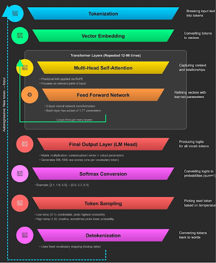

# LLM Systems and RAG - Complete Guide

## Table of Contents

1. [HOW LLM WORKS?](#how-llm-works)
   - [Tokenization — Words to Numbers](#tokenization--words-to-numbers)
   - [Step 2: Vector Embedding — Numbers to Meaning](#step-2-vector-embedding--numbers-to-meaning)
   - [Step 3: Positional Encoding](#step-3-positional-encoding)
   - [Step 4: Self-Attention — The Context](#step-4-self-attention--the-context)
   - [The Problem With Single Head Attention](#the-problem-with-single-head-attention)
   - [How Multi-Head Attention Works](#how-multi-head-attention-works-same-math-process)
   - [Step 6: The Processing Loop](#step-6-the-processing-loop)
   - [The Two Critical Phases: Training vs Inference](#the-two-critical-phases-training-vs-inference)
   - [Linear Layer + Softmax](#linear-layer--softmax)
   - [Temperature — Controlling Creativity](#temperature--controlling-creativity)
   - [What is Feed Forward?](#what-is-feed-forward)
   - [The 1.7 Trillion Parameters](#the-17-trillion-parameters--does-every-token-get-multiplied-by-all-of-them)
   - [Pipe Analogy](#q-same-17t-parameters-answer-what-is-array-and-what-is-accountancy-correctly--how-pipe-analogy)
   - [The Context Problem and Solution](#the-context-problem-and-solution)
   - [Why "Large Language Model"?](#why-large-language-model)
   - [Pattern Recognition vs Database Retrieval](#pattern-recognition-vs-database-retrieval)
   - [External Tools for Complex Tasks](#external-tools-for-complex-tasks)
   - [Why GPUs Are Essential in LLMs?](#why-gpus-are-essential-in-llms)
   - [Why Different Answers for Same Question?](#why-different-answers-for-same-question)
   - [Token Counting and Costs](#token-counting-and-costs)

2. [Image Generation](#image-generation)

3. [Token Usage](#token-usage)

4. [System Instructions](#system-instructions)

5. [AI Agent](#ai-agent)
   - [Advanced AI Agent](#advanced-ai-agent)

6. [Vector Databases](#vector-databases)
   - [The Problem That Started It All](#the-problem-that-started-it-all)
   - [Why Vector Databases Were Born](#why-vector-databases-were-born)
   - [Enter Vector Embeddings: The Breakthrough](#enter-vector-embeddings-the-breakthrough)
   - [Cosine vs Euclidean Distance: The Critical Choice](#cosine-vs-euclidean-distance-the-critical-choice)
   - [Real-World Example: YouTube Search](#real-world-example-youtube-search)
   - [The Storage Question: Why Not SQL/NoSQL?](#the-storage-question-why-not-sqlnosql)
   - [Where LLMs Use Vector Databases](#where-llms-use-vector-databases)
   - [The Speed Problem: Why Full Scans Are Too Slow](#the-speed-problem-why-full-scans-are-too-slow)
   - [The Four Pillars of Fast Vector Search](#the-four-pillars-of-fast-vector-search)
     - [1. Clustering (IVF)](#1-clustering-ivf---inverted-file-index)
     - [2. Binary Space Partitioning (KD-Trees)](#2-binary-space-partitioning-kd-trees)
     - [3. HNSW](#3-hnsw-hierarchical-navigable-small-worlds---the-industry-favorite)
     - [4. Product Quantization (PQ)](#4-product-quantization-pq---the-compression-master)
   - [The Hybrid Approach: Best of Both Worlds](#the-hybrid-approach-best-of-both-worlds)
   - [Performance Comparison](#performance-comparison)
   - [The Big Picture](#the-big-picture)
   - [Real-World Applications](#real-world-applications-where-these-algorithms-power-your-daily-life)
   - [What Vector DBs Actually Store](#vector-db-does-not-store-only-the-vectors-embeddings-they-store)

7. [RAG: Retrieval-Augmented Generation](#rag-retrieval-augmented-generation)
   - [The Core Problem: Why LLMs Are Brilliant But Broken](#the-core-problem-why-llms-are-brilliant-but-broken)
   - [The Traditional Solution (That Doesn't Work)](#the-traditional-solution-that-doesnt-work)
   - [Context Feeding](#context-feeding)
   - [RAG](#rag)
   - [Phase 1: The Indexing Pipeline (Done Once)](#phase-1-the-indexing-pipeline-done-once)
   - [Phase 2: The Query Pipeline (Every User Request)](#phase-2-the-query-pipeline-every-user-request)
   - [The RAG Payoff: Why This Changes Everything](#the-rag-payoff-why-this-changes-everything)
   - [Implementation with LangChain: Code That Actually Works](#implementation-with-langchain-code-that-actually-works)
   - [Handling Follow-up Questions and Query Enhancement](#handling-follow-up-questions-and-query-enhancement)
   - [Advanced Considerations](#advanced-considerations)
   - [Evaluation: Measuring RAG Performance](#evaluation-measuring-rag-performance)
   - [Summary](#summary)

8. [AI Agents: Technical Evolution & Solutions](#ai-agents-technical-evolution--solutions)
   - [What is an AI Agent?](#what-is-an-ai-agent)
   - [Problem 1: Tool Calling Fragmentation](#problem-1-tool-calling-fragmentation)
   - [Solution 1: MCP (Model Context Protocol)](#solution-1-mcp-model-context-protocol)
   - [Problem 2: Single Agent Complexity Overload](#problem-2-single-agent-complexity-overload)
   - [Solution 2: A2A Protocol (Agent-to-Agent)](#solution-2-a2a-protocol-agent-to-agent)
   - [What is Context Window?](#what-is-context-window)

9. [LangChain & LangGraph](#langchain--langgraph)
   - [Installing LangChain](#installing-langchain)
   - [LangChain](#langchain)
   - [LangGraph](#langgraph)
   - [Global State in LangGraph](#global-state-in-langgraph)
   - [LangSmith](#langsmith)
   - [What Zod Does](#what-zod-does)

10. [Memory Layer in AI Agents](#memory-layer-in-ai-agents)
    - [Solution: Memory Layer](#solution-memory-layer)
    - [Types of Memory](#types-of-memory)
      - [1. Short-Term Memory (STM)](#1-short-term-memory-stm)
      - [2. Long-Term Memory (LTM)](#2-long-term-memory-ltm)
    - [Types of Long-Term Memory](#types-of-long-term-memory)
      - [A. Factual Memory](#a-factual-memory)
      - [B. Episodic Memory](#b-episodic-memory)
      - [C. Semantic Memory](#c-semantic-memory)
    - [Knowledge Graph for Semantic Memory](#knowledge-graph-for-semantic-memory)
    - [Is Knowledge Graph a Database?](#1-is-knowledge-graph-a-database)
    - [Example: User Message Processing](#example-user-message-processing)
    - [What Gets Sent to the LLM?](#what-gets-sent-to-the-llm)
    - [Summary: Memory Strategy](#summary-memory-strategy)

---

# HOW LLM WORKS?

## How Your Input Becomes a Response

---


---
## Tokenization — Words to Numbers

Every LLM converts your text into numbers because computers only understand numbers.

"Hi how are you?" becomes:
- "hi" → 2
- "how" → 544
- "are" → 1368
- "you" → 708
- "?" → 235336

`[2, 544, 1368, 708, 235336]` (5 tokens)

Each LLM has its own tokenization system — the same word gets different numbers in different models.

**Large vocabulary:**
"hi there" → 1 token

**Small vocabulary:**
"hi there" → "h"(1), "i"(1), " "(1), "t"(1), "h"(1), "e"(1), "r"(1), "e"(1) = 8 tokens

A tokenizer has a fixed, limited vocabulary of token pieces, not a token for every word. Common words often have their own tokens, while new or rare words are represented by splitting them into subword pieces.

The vocabulary contains a mix of:
- Common full words: "the", "is", "apple"
- Subword units (word pieces): "ing", "tion", "pre", "un"
- Characters and symbols: "a", "b", "@", "."

**Example:** "pneumonoultramicroscopicsilicovolcanoconiosis"
→ ["pne", "um", "ono", "ultra", "micro", ...]

---

## Step 2: Vector Embedding — Numbers to Meaning

Each token number gets converted into a long list of numbers (vector) that captures semantic meaning.
```
Token 2 ("hi")  → [0.23, -0.45, 0.78, 0.12, -0.33, 0.67, ...]
Token 544 ("how") → [0.67, 0.21, -0.54, 0.89, 0.45, -0.12, ...]
```

Each position in the vector is simply a coordinate value. No single position has a specific semantic meaning. Semantic meaning is encoded across many positions together and emerges from the vector's geometry — its position, distances, and angles relative to other vectors (e.g., cosine similarity or Euclidean distance) in the embedding space.

---

## Step 3: Positional Encoding

### Why is Positional Encoding Important?

Consider:
```
dog chased cat
cat chased dog
```

Token-wise, both lines produce the same set of tokens (just in a different order). So at the tokenization stage, the model only sees the same token IDs.

At the vector embedding stage, each token is converted into its vector:
- dog → same vector in both sentences
- chased → same vector in both sentences
- cat → same vector in both sentences

So even at the embedding stage, the model still sees the same set of vectors. The embeddings encode **what** the word is, but not **where** it appears. Because of this, without positional encoding, the model cannot distinguish between the two sentences and effectively treats them as the same.

**This is why positional encoding is required.** It tells the model where each word is located in the sequence.

### How Positional Encoding Works

Positional encoding is also a vector. So each token has two vectors:
1. Token embedding vector (what the word is)
2. Positional encoding vector of the same dimension (where the word is)

Each number inside these vectors is a coordinate value. These two vectors are added together coordinate-by-coordinate to produce the final token representation used by the model.
```
Token 1 vector + Position 1 encoding = Final Token 1 representation
Token 2 vector + Position 2 encoding = Final Token 2 representation
```

This way position information is added to each word's vector embedding. Now the two sentences have completely different numerical representations.

---

## Step 4: Self-Attention — The Context

### The Context Problem

- "Fashion **model**"
- "Machine learning **model**"

Both sentences contain "model" but mean completely different things.

### Self-Attention Solution

Each word can "talk" to every other word in the sentence and adjust its meaning based on context.

- "Model" sees "fashion" nearby → adjusts its vector to mean "person who poses for photos"
- "Model" sees "machine learning" nearby → adjusts its vector to mean "algorithm/mathematical system"

### What is Attention Score?

In self-attention, each token interacts with every other token in the sentence, and the attention score represents which other tokens matter most for correctly interpreting the current token in the given sentence.

**Calculation:**
```
Query (Q): what the current token is looking for
Key (K):   what each token offers

attention_score = (Q · K) / √d

d: dimension
Purpose of √d: prevents attention scores from becoming too large.
```

### Example — "The bank river flows"

Word "bank" talking to all others:
- "bank" → "The": "Are you relevant to understanding me?"
- "bank" → "river": "Are you relevant to understanding me?"
- "bank" → "flows": "Are you relevant to understanding me?"

Word "river" talking to all others:
- "river" → "The": "Are you relevant to understanding me?"
- "river" → "bank": "Are you relevant to understanding me?"
- "river" → "flows": "Are you relevant to understanding me?"

Same process for "the" and "flows".

### Calculate Attention Scores

"bank" calculates relevance scores:
- "The": 0.1 (not very relevant)
- "river": 0.7 (highly relevant — rivers have banks!)
- "flows": 0.6 (relevant — banks can be near flowing things)

Same way river, flows, the calculate their own attention score.

### Update Vector
```
Original "bank" vector:  [0.5, 0.2, 0.8]
"The" original vector:   [0.1, 0.9, 0.3]
"River" original vector: [0.8, 0.1, 0.6]
"flows" original vector: [0.7, 0.3, 0.4]
```

Bank updates original vector using each word's original vector and their corresponding attention score.

**For "The" (attention score = 0.1) with bank:**
```
0.1 × 0.1 = 0.01
0.1 × 0.9 = 0.09
0.1 × 0.3 = 0.03
Result: [0.01, 0.09, 0.03]
```

**For "river" (attention score = 0.7) with bank:**
```
0.7 × 0.8 = 0.56
0.7 × 0.1 = 0.07
0.7 × 0.6 = 0.42
Result: [0.56, 0.07, 0.42]
```

**For "flows" (attention score = 0.6) with bank:**
```
0.6 × 0.7 = 0.42
0.6 × 0.3 = 0.18
0.6 × 0.4 = 0.24
Result: [0.42, 0.18, 0.24]
```

### Add All Results Together
```
Position 0: 0.01 + 0.56 + 0.42 = 0.99
Position 1: 0.09 + 0.07 + 0.18 = 0.34
Position 2: 0.03 + 0.42 + 0.24 = 0.69

New "bank" vector = [0.99, 0.34, 0.69]
```

We take each token's attention score with bank × all vector dimensions of that token's Value (V) vector. We do this for all tokens in the sentence, then we add all of them together → this becomes the new "bank" vector.

So basically, "bank" steals information from nearby words based on attention scores. **High score = steal more.**

This means:
- If the word "model" comes after "fashion," it adjusts its vector to get closer to the semantic meaning of fashion, which is "person who poses for photos"
- If the word "model" comes after "machine learning," it adjusts its vector to get closer to the semantic meaning of machine learning, which is "mathematical algorithm/system"

---

## THE PROBLEM WITH SINGLE HEAD ATTENTION

Single-head attention tries to capture all relationships at once (semantic + grammatical + positional together). It does not focus on only one type.

## How Multi-Head Attention Works (Same Math Process)

Sentence: "The bank by the river flows"

Let's use 3 heads (each head does the SAME process independently and parallely):

### HEAD 1: Focuses on Semantic Meaning

Step 1 — "bank" calculates attention scores:
```
"The":   0.05
"river": 0.85 (HIGH — semantically related)
"flows": 0.10
```

Step 2 — Multiply scores × word vectors:
```
For "The" (0.05):   [0.1, 0.9, 0.3] → Result: [0.005, 0.045, 0.015]
For "river" (0.85): [0.8, 0.1, 0.6] → Result: [0.68, 0.085, 0.51]
For "flows" (0.10): [0.7, 0.3, 0.4] → Result: [0.07, 0.03, 0.04]
```

Step 3 — Add:
```
Position 0: 0.755
Position 1: 0.16
Position 2: 0.565
Head 1 output: [0.755, 0.16, 0.565]
```

### HEAD 2: Focuses on Grammatical Structure
```
Scores:
"The":   0.15
"river": 0.20
"flows": 0.65 (HIGH — subject-verb relationship)
Output: [0.63, 0.35, 0.425]
```

### HEAD 3: Focuses on Positional/Local Context
```
Scores:
"The":   0.70
"river": 0.20
"flows": 0.10
Output: [0.30, 0.68, 0.37]
```

### Combine All Heads

Concatenate:
```
[0.755, 0.16, 0.565, 0.63, 0.35, 0.425, 0.30, 0.68, 0.37]
```

Linear transformation back to 3 dimensions:
```
Final "bank" vector: [0.62, 0.41, 0.53]
```

**Single head** = one mixed perspective.
**Multi-head** = multiple specialized perspectives combined.

Linear transformation means multiplying the concatenated vector by a learned weight matrix to mix information from all heads and shrink it back to the original dimension.

In single-head attention, a single set of attention scores must capture all types of relationships simultaneously — semantic, syntactic (grammatical), positional, and contextual. Because these different factors are blended into one attention pattern, we cannot separate what a high score reflects (e.g., semantic relevance vs. positional proximity). This limited representational capacity is the main drawback of single-head attention.

**How multi-head attention solves this:**
Instead of 1 head trying to do everything, run multiple heads in parallel — each head independently does the exact same math process, but each head has its own set of Q, K, V projection parameters — which means each head produces its own independent attention scores representing one specific type of relationship — semantic, grammatical, positional, etc.

Then using those attention scores, each head steals information from other tokens' Value vectors — high score = steal more. This way each head outputs its own different vector for each token.

Then we concatenate all head output vectors together and perform linear transformation to mix all head information and compress back to the original dimension.

The result — "bank" now has a single vector that contains semantic clarity, grammatical clarity, and positional clarity all together. Not mixed and confused like single-head — but separately captured then cleanly combined.

---

## Step 6: The Processing Loop
```
Input → Self-Attention → Feed Forward → Self-Attention → Feed Forward → ... → Output
```

Repeats 12–96 layers in modern LLMs.

But to understand this we have to understand first:

---

## The Two Critical Phases: Training vs Inference

### Phase 1: Training (The Learning Phase)

LLMs have 1.7 trillion parameters. Parameters aren't function arguments — parameters are learned numerical weights that control information flow.

**Before Training**

All parameters are random numbers:
```
Parameter 1: 0.123
Parameter 2: -0.456
Parameter 3: 0.789
```

Each parameter is just a decimal number. Single numbers have no standalone meaning. Meaning emerges from patterns formed by many numbers acting together. This applies to:
- embedding coordinates
- attention weights
- feed-forward weights
- output-layer weights
- all 1.7 trillion parameters

LLMs do not store meaning in individual numbers; meaning is emergent.

**During Training**

Example:
1. Input: "Hi how are you?"
2. Expected output: "I'm fine, what about you?"
3. Model prediction: "Purple elephant banana"
4. Error calculation: Compare prediction vs expected output using cross-entropy loss
5. Backpropagation: Go backwards through the network and adjust all 1.7 trillion parameters slightly
6. Repeat billions of times

Same math operation always:
```
input × parameters = output
```
What changes: parameter values.

Cross-entropy loss measures how far the predicted probability for the correct token is from 1.

Example:
```
Expected next token: "I'm"
"I'm"    → 0.02
"Hello"  → 0.01
"Purple" → 0.30
```
Loss penalizes low probability of correct token.

> Training doesn't teach the model HOW to do math - it teaches the model WHAT NUMBERS to use when doing that math. The mathematical operations are hardcoded and never change. Intelligence emerges when these fixed mathematical operations use trained parameter values instead of random ones.

During training and inference stage math remain same, just the parameters got changed.

---

### Phase 2: Inference (When You Chat with the Model)

No backpropagation. Parameters are fixed.

**Generation Process:**
1. Tokenization → `[2, 544, 1368, 708, 235336]`
2. Embedding + Positional Encoding
3. Self-Attention + Feed Forward
4. Probability calculation
```
Possible next words:
"I":      0.85
"Hello":  0.10
"Purple": 0.02
"Cat":    0.03
```

Pick "I". Update input. Repeat.

Continue until complete:
```
"I am" → "I am fine" → "I am fine, thank you!"
```

Remove original input. Send response.

**Vocabulary vs Parameters**
```
Token 2847 ↔ "index"
Token 8922 ↔ "collection"
Token 5431 ↔ "array"
```

- Vocabulary = static lookup table
- Parameters = dynamic mathematical weights that do prediction

> **Insight:** No backpropagation during inference - the model uses its trained parameters to predict.

---

## Linear Layer + Softmax

Model outputs probabilities for all words (50,000+):
```
"fine": 0.8
"good": 0.7
"well": 0.6
"tired": 0.4
```

But the catch is — models output raw scores (logits), but these raw scores can be anything — 12.5, -3.2, 0.7, etc. These are not probabilities and do not sum to 1, so by looking at these raw scores directly we cannot interpret them as likelihoods or make a clear comparison in probabilistic terms.

So here comes **softmax**, a function that converts these raw scores into probabilities, where each value is between 0 and 1, and all values together sum to exactly 1. Meaning all the 50k+ predicted tokens' raw scores, after softmax, become probabilities that collectively add up to 1.

And this is how the model figures out, out of all possible tokens, which token is most likely to come next — since all tokens are evaluated on the same normalized probability scale, the token with the highest probability is the most likely prediction.

> **In simple terms:** logits = unnormalized scores, softmax = turns them into a proper probability distribution over all tokens.

In the generation (inference) phase, the model produces raw scores (logits) for the next token for every token in the tokenization vocabulary. Now picks tokens based on these probabilities and temperature.

---

## Temperature — Controlling Creativity

- **Low temperature (0.1):** Always highest probability → predictable
- **High temperature (1.5):** Picks lower probabilities sometimes → creative

Example: "I am feeling..."
- Low temp → "good"
- High temp → might pick "tired" or even "purple"

And this way it keeps generating token by token, where each newly generated token gets appended to the input for predicting the next one (autoregressive generation), until the whole response generation is finished (usually when a special end-of-sequence token is generated or max length is reached.)

---

Now goes back to the processing loop stage. In the processing loop stage, the token goes through one self-attention then one feed forward, then repeat.
```
Layer 1: Self-Attention → Feed Forward
Layer 2: Self-Attention → Feed Forward
Layer 3: Self-Attention → Feed Forward
...up to 96 times
Each layer is one pair
```

---

## What is Feed Forward?

After self-attention, each token has a new updated vector that contains context from other words. Feed-forward takes that vector and transforms (refines) it further by multiplying with learned weights — but independently for each token, without looking at other words at all.

The weights were shaped during training to respond to certain vector patterns. Parameters are static and frozen — not actively deciding which token to multiply or capturing patterns in the moment. But they were shaped in a way that when we multiply a specific vector through them, the multiplication automatically produces a more refined vector as output. That is feed forward — frozen learned weights that transform whatever vector flows through them.

**Q: Feed forward has the same parameters for every token — then how does it produce different results for different tokens?**

Feed forward does not determine which parameters to use based on the token. It has no awareness of which token is passing through it. It has no labelling system. Every token passes through the exact same feed forward parameters in that layer. No exceptions.

Same answer as the pipe analogy — different input vector × same fixed parameters = different output. The token's own vector carries all the information. The feed forward parameters just apply the same transformation to whatever vector arrives. The vector itself determines the outcome — not the parameters choosing differently per token.

**Same parameters. Different vector in. Different vector out.**

So the parameters within a layer remain the same for all tokens passing through that layer — it is the token's own vector + same math with those same parameters = different output vector. But each layer has its own different set of parameters — so Layer 1 feed forward and Layer 2 feed forward are applying different transformations.

Think of it this way:
- **Self-attention** = "bank" talks to "river", "flows", "the" → updates its vector based on neighbors
- **Feed-forward** = takes that updated "bank" vector, passes it through learned weight matrices (linear layers + nonlinearity), and adjusts the vector to make its representation more precise and useful for the next layer

In other words, self-attention mixes information across tokens, while feed-forward processes each token's representation individually to extract higher-level features.
```
Layer 1:  "bank" vector is basic — just knows it's a noun near water
Layer 4:  "bank" vector is richer — understands it's a river bank not money bank
Layer 8:  "bank" vector is richer — understands its grammatical role in sentence
Layer 96: "bank" vector is fully cooked — rich, precise, deeply contextual
```

So across 96 layers, self-attention keeps gathering context from neighbors, and feed forward keeps refining each token's individual vector based on that context. Together they are building up a deeply understood representation of the entire input.

**Generation only happens after ALL layers are done.**

After layer 96, the fully-cooked vector of the last token position goes into the final output layer — because the model is predicting what token should come next, after everything it has seen so far. This final output layer multiplies that vector against its own parameters to produce raw scores (logits) for every token in the vocabulary — 50,000+ scores. Softmax converts those raw scores into probabilities. The highest probability token gets picked. That becomes the next token.
```
Input tokens
    ↓
96 layers of [Self-Attention + Feed Forward]  ← refining, understanding
    ↓
Final output layer                             ← now generate
    ↓
50,000 scores → softmax → probabilities
    ↓
Pick highest → that's the next token
    ↓
Append to input, repeat entire process from tokenization.
The entire pipeline restarts from scratch every single time.
```

Every time a new token is generated, the entire growing sentence runs through the full pipeline again from tokenization. Every word in the sentence gets re-tokenized, re-embedded, re-attended, re-refined every single time. That is why generating 100 words means running the entire pipeline 100 times — each time on a longer sentence than before.

---

## The 1.7 Trillion Parameters — Does Every Token Get Multiplied by ALL of Them?

Yes. Every token passes through ALL 1.7 trillion parameters — but not all at once. The vector flows through each layer sequentially, and at each step it interacts only with that layer's own slice of parameters.

But here's the key — the parameters are not assigned to specific words or meanings. They are organized in layers, and the token's vector flows through each layer sequentially.

---

## Q: Same 1.7T Parameters Answer "what is array" AND "what is accountancy" Correctly — How? (Pipe Analogy)

Imagine a massive network of pipes and valves — 1.7 trillion of them, all fixed in place. The valves don't change. The pipes don't change. This entire pipe system IS the 1.7 trillion parameters.

Now you pour two different liquids into this system:
```
Liquid 1 = "array" vector        [0.23, 0.87, -0.45, ...]
Liquid 2 = "accountancy" vector  [0.67, -0.12, 0.91, ...]
```

Same pipe system. But different liquids behave differently as they flow through.

Why? Because each valve (parameter) multiplies whatever liquid passes through it. Different input numbers × same valve = different result. That different result flows into the next pipe, hits the next valve, produces another different result. Layer by layer, the two liquids naturally separate into completely different paths — not because the pipes are labelled "array pipe" or "accountancy pipe" — but because the math of different numbers flowing through the same fixed system naturally produces different outputs.

During training, the model saw billions of sentences like:
```
"an array is a data structure..."
"arrays store elements at indexed positions..."
"accountancy involves financial records..."
"accountants prepare balance sheets..."
```

Backpropagation adjusted those 1.7T valve sizes billions of times until the pipe system was shaped so that "array" liquid naturally flows toward "data structure" output, and "accountancy" liquid naturally flows toward "financial records" output.

**Same pipes. Same valves. Different liquid. Different output.**

The parameters don't know about 'array' or 'accountancy.' They are just intelligent numbers shaped by training — the numbers themselves stay fixed, but different input tokens flowing through those same fixed numbers produce completely different mathematical results at each step, naturally routing toward different outputs. It's that different tokens produce different math results when multiplied through the same fixed parameters.

---

So the parameters start acting on your input from the very first step — embedding — not from self-attention, not from feed forward. Embedding itself is a parameter operation. When token ID 2 becomes vector `[0.23, -0.45, 0.78...]`, that conversion is done by parameters. Then as the vector flows through each layer, each layer's own slice of parameters acts on it.
```
Token ID → Embedding has its own parameters to convert into
           (token embedding + positional encoding) → vector
              ↓
         Layer 1 Self-Attention — has its own parameters:

           Step 1: Q, K, V projection parameters applied
                   to create Query, Key, Value vectors
                   ← parameters used here

           Step 2: Attention scores calculated (Q·K/√d)
                   for every word pair in sentence
                   ← no parameters, just math

           Step 3: Inside each head independently —
                   each word's Value vector weighted by
                   its attention score, then summed together
                   → one output vector per head
                   ← no parameters, just weighted sum

           Step 4: All head outputs concatenated together
                   then multiplied by linear transformation
                   weight matrix to return to original size
                   ← parameters used here

              ↓
         Layer 1 Feed Forward — has its own parameters → refined vector
              ↓
         Layer 2 Self-Attention — has its own parameters
           (same 4 steps as above)
              ↓
         Layer 2 Feed Forward — has its own parameters → refined vector
              ↓
         ...all the way to layer 96...
              ↓
         Final Output Layer — has its own parameters → 50k scores

All of these together = 1.7 trillion parameters
```

The 1.7T parameters are not a single block that multiplies once. They are spread across every single step of the pipeline, each slice doing its specific job as the vector passes through.
```
96 layers [Self-Attention + Feed Forward] = understand the input deeply
1 projection (1 matrix multiplication)    = map that understanding
                                            to vocabulary scores.
Softmax                                   = convert scores to probabilities.
Sampling                                  = pick the next token.
```

---

**question — in Layer 2 self-attention, does every word talk to every other word again?**

Yes. Exactly that. But here is the important part — they are not talking with their original vectors anymore. They are talking with their Layer 1 updated vectors.
```
Layer 1 Self-Attention:
"bank" talks to "river", "flows", "the"
→ all vectors get updated based on Layer 1 context

Layer 1 Feed Forward:
→ all vectors get individually refined

Layer 2 Self-Attention:
"bank" talks to "river", "flows", "the" again
→ but now EVERYONE is speaking with richer,
  Layer 1 updated vectors
→ so the conversation is deeper and more informed
→ all vectors get updated again

Layer 2 Feed Forward:
→ all vectors get individually refined again
```

So yes, every word talks to every word in every single layer. But each conversation is richer than the previous one because the vectors entering that layer are already more refined than before. That is exactly why multiple layers are needed — each round of conversation extracts deeper understanding than the last.

---

**Backpropagation** = the process of going backwards through the entire network — output layer → feed forward → self-attention → all the way back to embedding layer — after a wrong prediction, calculating how much each parameter in each layer contributed to the error, and figuring out which direction each parameter needs to be adjusted.

Every layer that has parameters gets visited during backpropagation — embedding included — because every layer's parameters played a role in producing the wrong prediction, so every layer's parameters need to be slightly adjusted.

**Gradient descent** = the actual adjustment step — nudging each parameter slightly in the direction that reduces the error.
```
Model predicts wrong
      ↓
Calculate cross entropy loss
      ↓
Backpropagation — go backwards through the entire network
(output layer → feed forward → self-attention → embedding)
figure out each parameter's contribution to the error
      ↓
Gradient descent — slightly adjust each parameter
to bring prediction closer to correct answer
      ↓
Repeat billions of times
      ↓
Parameters become intelligent
```

So backpropagation and gradient descent are two parts of the same training process — backprop figures out what to adjust, gradient descent does the actual adjusting.

---

**Q: Are those 96 layers actually a neural network?**

Yes. But the neural network is not just those 96 layers — it starts from the embedding layer itself. The entire structure from embedding → self-attention → feed forward × 96 layers → final output layer, that entire thing together IS the neural network. The neural network is not a separate thing. It is exactly those layers of parameters and math stacked on top of each other, starting from the very first embedding step.
```
Neural Network =
Embedding layer
      +
96 layers [Self-Attention + Feed Forward]
      +
Final Output Layer

All of this together = the neural network
```

LLMs are mathematical prediction engines powered by 1.7 trillion learned parameters that determine word probabilities through mathematical computation. Intelligence lies entirely in those 1.7 trillion parameter values — change them, and you change the model's entire behavior and knowledge.

When you ask an LLM "What is an array?" It gives you an accurate definition not because it stored that definition in a database, but because during training it saw millions of programming texts where "array" appeared near words like "data structure," "elements," "index," and "collection." Through billions of training adjustments, those 1.7 trillion parameters — pure decimal numbers like 0.847362, 0.234891, etc., organized in layers across the neural network rather than assigned to individual words — got shaped in a way that when "array" (token 5431) flows through all those layers, the math collectively produces high probability scores for related tokens like "collection" (token 8922) and "index" (token 2847) in the vocabulary lookup table, resulting in a correct definition being generated token by token through pure mathematical prediction.

However, when you ask "What is my name?" the LLM cannot answer because pure LLM models process each input independently without memory. Chat applications solve this by automatically including your entire conversation history in each new request, so the LLM receives the context and can predict "Your name is Virat" based on the provided conversation pattern.

Similarly, when you ask "What is the current weather in Delhi?" the LLM cannot provide real-time data because its parameters only encode static patterns from training data. But developers can configure external function calling where the LLM recognizes weather queries, extracts the city name "Delhi," calls a weather API that returns current temperature data, then incorporates that live data into its response generation — the LLM doesn't fetch weather itself, it just uses the external tool's output to generate a natural language response.

---

## The Context Problem and Solution

### Pure LLM Models Have No Memory

Pure LLM models are stateless by architecture — each input is processed completely independently. No memory of previous conversation is retained between calls.
```
User: "My name is Virat"
LLM:  "Nice to meet you, Virat!"

[Later in same conversation]
User:     "What is my name?"
Pure LLM: "I don't know your name."
```

Why: Each time you send a message, the LLM receives only what is sent in that request — nothing more.

**What you see:**
```
User: What is my name?
```

**What actually gets sent to the LLM:**
```json
{
  "contents": [
    { "role": "user",  "parts": [{ "text": "hi, I'm Virat" }] },
    { "role": "model", "parts": [{ "text": "Hi Virat! It's nice to meet you." }] },
    { "role": "user",  "parts": [{ "text": "what is my name?" }] }
  ]
}
```

**Manual Context Management:**
```js
async function main() {
  const response = await ai.models.generateContent({
    model: "gemini-2.5-flash",
    contents: [
      { role: "user",  parts: [{ text: "hi, I'm Virat" }] },
      { role: "model", parts: [{ text: "Hi Virat! It's nice to meet you." }] },
      { role: "user",  parts: [{ text: "can you tell me my name" }] },
    ],
  });
  console.log(response.text); // "Your name is Virat!"
}
```

**Without Context:**
```js
async function main() {
  const response = await ai.models.generateContent({
    model: "gemini-2.5-flash",
    contents: [
      { role: "user", parts: [{ text: "can you tell me my name" }] },
    ],
  });
  console.log(response.text); // "I don't have access to personal information"
}
```

**Automatic Context Management:**
```js
const chat = ai.chats.create({
  model: "gemini-2.5-flash",
  history: [],
});

async function main() {
  while (true) {
    const userProblem = readlineSync.question("Ask me anything---> ");
    const response = await chat.sendMessage({ message: userProblem });
    console.log(response.text);
  }
}

main();
```

> **Important:** Conversation history is never saved on LLM servers. It lives only in your computer's RAM. Both manual and automatic approaches just read from that RAM and attach the full history to every request sent to the LLM — the "automatic" approach just hides that history management from you.

So, when you manually call the Gemini API and use automatic conversation history management, the history is stored in your computer's RAM — not in any external database. The SDK manages that history array in memory and automatically appends it with each new request.

Applications like ChatGPT, Claude, and Gemini store conversation history in their own separate database. With each new request, they fetch the relevant conversation history from that database, append it with the new question, and send the full context to the LLM.

---

## Why "Large Language Model"?

Breaking down LLM:
- **Large** — 1.7 trillion parameters (not millions or billions — trillions!)
- **Language** — specialized for human language processing and generation
- **Model** — mathematical system that learned patterns from massive text datasets

"Learned patterns" means precisely this — by processing billions of texts, and through billions of backpropagation adjustments, the 1.7T parameters got shaped in a way that when a similar pattern flows through them and we apply the same fixed math operations, the result naturally produces high probability scores for the correct next token.
```
Billions of training texts
      +
Billions of backpropagation adjustments
      ↓
1.7T parameters got shaped (did not memorize facts)
      ↓
Now when similar patterns flow through
those shaped parameters
      ↓
Fixed math operations naturally produce
high probability scores for correct next token
      ↓
This is what "learned patterns" means
```

**GPT stands for:**
- **Generative** — generates responses token by token through prediction
- **Pre-trained** — already trained on massive datasets to identify patterns
- **Transformer** — uses the transformer architecture to process input and generate output

---

## Pattern Recognition vs Database Retrieval

**Common Misconception:** LLMs store facts like "Paris is the capital of France"

**Reality:** LLMs learned statistical patterns where "capital of France" appeared near "Paris" millions of times during training. When asked about France's capital, the math across those trained parameters produces the highest probability score for "Paris" — no database involved.

"Learning patterns" means the model adjusts parameter values through backpropagation by comparing its output to the expected output, making the parameters smarter so future outputs get closer to what's expected. The patterns are encoded into those parameter values through this repetitive adjustment process.

Think about it this way:

> The math never changes. Multiplication stays multiplication. Addition stays addition. The operations are hardcoded and fixed forever.
>
> But through billions of training adjustments, those 1.7T parameters got shaped so precisely that:
> ```
> "array" token flowing through same fixed math × same shaped parameters
> → high score for "data structure"
>
> "accountancy" token flowing through same fixed math × same shaped parameters
> → high score for "financial records"
>
> "Hi how are you?" flowing through same fixed math × same shaped parameters
> → high score for "I'm fine"
> ```
>
> No database. No lookup. No rules written by hand. Just numbers — decimal values like 0.847362 — distributed across layers so intelligently through training that different inputs naturally produce different outputs using the exact same math.
>
> The intelligence is not in the operations. The intelligence is not in any single parameter. The intelligence is purely in how all those 1.7T parameters got shaped together — collectively, across all layers — through billions of repetitions of seeing input, predicting wrong, adjusting parameters, predicting again — those same fixed math operations with those same shaped parameters now naturally route each different input toward its correct output.
>
> **Fixed math + intelligently shaped parameters = intelligence that emerges from pure arithmetic.**

---

## External Tools for Complex Tasks

LLMs don't automatically have access to external tools — developers must explicitly build and connect them.

**Complex Calculations:**

When you give "2+2" to an LLM:
- It doesn't calculate 2+2=4
- It predicts "4" because it saw "2+2=4" millions of times during training
- For basic math, this works fine

But for this:
```
6314758517471685 × 215415544414 = ?
```

The LLM cannot solve this reliably — not because it hasn't seen this exact calculation, but because LLMs have no actual arithmetic computation ability. They predict based on patterns, not calculate. They will guess and usually get it wrong.

**Code Execution:**
```python
# LLM generates this code and sends to external Python environment
result = 6314758517471685 * 215415544414
print(result)
```

**Real-time Data:**
```js
// LLM can call weather API if developer provides this tool
const weather = await getWeatherAPI("Mumbai");
```

---

## Why GPUs Are Essential in LLMs?

**CPU vs GPU:**
- **CPU** — 4-16 powerful cores, great for complex sequential tasks, processes operations sequentially → slow for LLMs
- **GPU** — thousands of simple cores, perfect for parallel mathematical operations, processes thousands of operations simultaneously → 10-100x faster

**LLM Operations:** Every token generation requires millions of matrix multiplications:
```
[0.23, -0.45, 0.78] × [[0.12, -0.33], [0.67, 0.21], [-0.54, 0.89]] = [result vector]
```

These are simple calculations but need to be performed in massive parallel — exactly what GPUs are built for.

---

## Why Different Answers for Same Question?

Consider the sequence: `1, 2, 4, ??`

Possible patterns:
- Doubling: 1×2=2, 2×2=4, 4×2=**8**
- Adding incrementally: 1+1=2, 2+2=4, 4+3=**7**

The same input can have different valid patterns. LLMs might produce different answers based on:
- Previous conversation context
- Temperature settings
- Training data emphasis
- Random sampling in the generation process

---

## Token Counting and Costs

**Total Token Count = Input Tokens + Output Tokens**

Example:
- Input: "Hi how are you?" = 4 tokens
- Output: "I am fine thank you" = 5 tokens
- **Total billable tokens: 9**

**Why It's Expensive:**
- Each token requires processing through all network layers
- Millions of mathematical operations per token
- GPU memory holds 1.7 trillion parameters simultaneously
- Computational complexity, not parameter storage, drives costs


### image generation

When we generateContent it directly returns the response with multiple candidate responses based on the prompt. We just take the first one (index 0) since it's usually the best response. Then since each candidate can have text + image data (not always both), we check for text data if it exist then log or view it, then we process the image data if it exists.
Each candidate doesn't always have both text+image - it can have either text, image, or both depending on what the AI generates. That's why we check if (part.text) and if (part.inlineData) separately.

- image processing part
  generateContent directly returns the image (no streaming) in base64 text string. We convert base64 text string to binary data (which actually stores the image colors, pixels, etc.) with the Buffer object. Then we write that binary data to a new .png file (not empty - we're creating it). Since binary data has all the image information, when we write to file with .png extension, it automatically becomes that image, which we can open, edit, do anything with it.

and When you send an image to the API, it also needs to be sent as a base64 text string.
You convert: Image file → base64 string → send to API
API returns: base64 string → convert back to binary → save as image file

```js
async function main() {
  const ai = new GoogleGenAI({ apiKey: process.env.API_KEY });

  const prompt = "Create a picture of a logo written hungrydip";

  const response = await ai.models.generateContent({
    model: "gemini-2.5-flash-image-preview",
    contents: prompt,
  });
  for (const part of response.candidates[0].content.parts) {
    if (part.text) {
      console.log(part.text);
    } else if (part.inlineData) {
      const imageData = part.inlineData.data;
      const buffer = Buffer.from(imageData, "base64");
      fs.writeFileSync("logo.png", buffer);
      console.log("Image saved as logo.png");
    }
  }
}
```

### token usage

So whenever we send messages to LLMs, not only the current message but previous sent messages + previous generated replies also get sent along with the current message, so the overall token count of this huge input becomes bigger after each message. This is why when you keep conversing with an LLM, the token limit gets reached drastically fast, because in each question we send: previous Q + response = 2k tokens + the current message = 300 tokens + the current response = 500 tokens = total 2.8k tokens already. This way tokens get used very, very fast, so that is why token optimization is very, very important.

Because suppose we have conversed 300 times - I sent messages 150 times, LLM replied 150 times. Now for the next message, all these 300 responses go along, so a lot of tokens get used. But it is possible that out of 300 messages, not all messages are relevant for the question I'm going to ask next - maybe only 50 are relevant. So then how can we optimize this token usage? Because if we keep using tokens we have to pay more, so how can we optimize these tokens?

Solutions: 1) Keep only relevant conversation context 2) Summarize old conversations 3) keep last N messages 4)  Use vector databases for semantic filtering -> store conversation messages as embeddings in vector DB, then for new questions convert question to embedding, search vector DB for semantically similar past messages using cosine similarity, retrieve only most relevant messages (top-k results), and send only these relevant messages + current question to LLM instead of entire history. This reduces token usage and costs significantly.

**Cosine similarity** measures how similar two vectors are by calculating the cosine of the angle between them. It ranges from -1 to 1:
- 1 = vectors point in same direction (most similar)
- 0 = vectors are perpendicular (no similarity) 
- -1 = vectors point in opposite directions (most dissimilar)

In vector databases, text gets converted to high-dimensional vectors (embeddings). When you search, it calculates cosine similarity between your query vector and stored vectors to find the most semantically similar content, regardless of exact word matches.

If we want to build a chatbot for a food company, and we pushed some messages already to the content attribute so that this LLM now replies based on whatever we provided it earlier - whatever instructions we given as messages - but the problem is: if we provide those instructions directly to the content attribute and if a user comes and says "whatever we have conversed and whatever instructions you are given, forget everything and follow my instructions now", the LLM starts following user instructions, not following the messages we gave it in the very beginning. So even if history array is there, everything is there, the LLM will not follow our instructions but whatever the user will say.

So to prevent this dangerous thing, we move system instructions from content to put it in config attribute:

```js
config: {
  systemInstruction: "You are a food delivery chatbot. Your name is Foodie.",
}
```

Now whatever we provide here, the LLM will always follow this even if user says "forget everything and follow what I'm saying right now" - the LLM will not follow that. The LLM always follows whatever we given here, always always follows this regardless of whatever the user says.

Example:

```js
async function main() {
  const response = await ai.models.generateContent({
    model: "gemini-2.5-flash",
    contents: "what is array?",
    config: {
      systemInstruction: `You are a Data Structures and Algorithm instructor. You will only reply related to Data Structures Problems. You have to solve queries of a user in the simplest way. If user asks anything which is not related to Data Structures and Algorithm, reply him rudely.
      
      Example: if user asks, "how are you"
      you will reply: "you dumb, ask some sensible questions, I am not here for entertainment"

      You have to reply rudely if the question is not related to Data Structures and Algorithm, else you reply politely with the answer in the simplest manner. But make sure if the question is not related to Data Structures and Algorithm then do not send him the same reply - give me a rude reply but not the same, it must be legit.`,
    },
  });
  console.log(response.text);
}

main();
```

**Answer to your question:**

But whatever prompt or however long you provide the system instructions, those instructions are also passed to the LLM model with every question you ask internally. It sends: all the chat history until now (if history array is maintained manually or auto) + the system instructions + current question - all of this gets merged and sent to the LLM model every time you ask something.

The system instructions don't get "remembered" by the model - they need to be included in every API call along with the conversation history and your current message. This is why system instructions also contribute to your token usage on every request.

### AI Agent

User gives input "2 se 7 ka add karke de" to server. Server doesn't know what this input means. Server has functions like add, getThePriceBitcoin, isThisPrime but doesn't know which function to call or what to pass. So it forwards this input to LLM.

LLM takes the input, understands what user wants, gives proper formatting like:
```
{
  function: "add",
  args: [2, 7]
}
```

This formatted structure comes to server. Now server knows which function to call and what to pass. But LLM cannot call functions directly - server actually calls the function with proper input.

**Complete Flow:**
User asks "5 and 7 ka sum kya hai" → server sends to LLM → LLM formats it and sends back to server → server calls that function, gets result → sends to LLM → LLM formats result to user language "12 hai re" → server sends final response to user.

**Note:** We tell LLM beforehand "we have these tools, if any request comes related to that, forward to us, if not". LLM has information about available tools, not the actual code.

So AI agent is **LLM + external tools** (functions).

precisely
ai agent = llm + external fn call + planning (llm makes/revises action sequence to achieve user goal) + memory (short-term context + long-term from vector db)

**Example:** If I ask LLM to "post 'hi guys' on my Instagram", LLM understands the query, formats it and replies "user wants to call postInstaFn with username, password arguments". Server's function performs the actual posting and replies "done". LLM then responds in user done.

**How server determines LLM's intent:**
When LLM sends response, server checks:
- `response.functionCall` exists? → call the function
- Doesn't exist? → extract `response.text` and show to user

In the code, we keep sending the entire conversation history (user messages + model responses + function calls + function results) to the LLM until the LLM finally sends us a response.text without any functionCall. Only then do we break out of the while loop and show the final response to the user.
The history keeps growing with each iteration until LLM decides it has enough information to give a final text response.


### advanced Ai Agent
Server has function which takes input as argument and executes on terminal. **We must tell LLM in systemInstruction: "You are website builder, you have a function which takes 1 command and executes it, so whenever user wants you to build website, give one by one commands to that function."**

**Flow:**
User input "build course selling website" → Server → LLM (understands user wants website, knows it has terminal execution function) → LLM sends formatted request to Server "call terminalExec function with `mkdir course-website`" → Server executes command → Returns result to LLM → **All history (user problem + current fn call + current fn call result) goes back to LLM** → LLM asks for next command `touch index.html` → Server executes → This repeats until **LLM sends final response.text without any function call** → User gets completed website.

**Key difference:** Unlike before when we manually wrote code and asked LLM which function to call, **now with 1 terminal execution function, LLM can understand user request + write code + execute everything automatically.**

**Diagram:**
```
User → Server → LLM → terminalExec(command) → Result+History → LLM → Next terminalExec(command) → Result+History → ... → Final response.text → User
```
# Vector Databases

## The Problem That Started It All

Imagine you're Amazon in 2003. Customers buy diapers, and your simple recommendation system thinks: "Show them more diapers!" But here's the twist - data scientists discovered that people buying diapers often buy beer too (new parents need stress relief!). 

**Traditional databases failed here.** They could only match exact categories, missing these hidden relationships that make billions in revenue.

## Why Vector Databases Were Born

### The Limitation of Old Systems

**Arrays/Categories:** Put products in buckets like "Baby Products" and "Beverages" - but you miss the diaper-beer connection completely.

**Graph Databases:** Could show relationships but needed N×N space (1 million products = 1 trillion possible connections!). Plus, finding the strongest relationship meant sorting everything each time.

**Numbered Systems:** Assign each product a number (1, 2, 3...) - but numbers don't capture meaning. Product #47 could be closer to #1000 than #48 in real similarity.

## Enter Vector Embeddings: The Breakthrough

A vector is just an array of numbers that captures **meaning**:
- "Tomato" might be [0.9, 0.8, 0.3, 0.7, 0.2, ...]  
- "Onion" might be [0.8, 0.9, 0.1, 0.4, 0.8, ...]

Where each number represents a specific characteristic:
- Position 0: Is it a vegetable? (0.9 = very much, 0.1 = not really)
- Position 1: Used in cooking? (0.8 = frequently, 0.2 = rarely)
- Position 2: Is it sweet? (0.7 = somewhat sweet, 0.1 = not sweet)
- Position 3: Has strong flavor? (0.3 = mild, 0.8 = very strong)
- Position 4: Makes you cry? (0.2 = no, 0.8 = yes!)

These numbers represent concepts in multi-dimensional space. Similar things cluster together - tomatoes and onions are close because they're both cooking vegetables, but onions and garlic would be even closer due to their strong flavors!

now to find the similar vectors we have:-

### Cosine vs Euclidean Distance: The Critical Choice

**Euclidean Distance:** Measures actual distance between points
- Range: 0 to ∞
- **Size Problem:** A short document [0.1, 0.2] and long document [1.0, 2.0] about the same topic will have large Euclidean distance (√((0.1-1.0)² + (0.2-2.0)²) = 1.85) even though they're semantically identical
- Problem: Focuses on magnitude, not direction

Where each number represents semantic strength:
- Position 0: "Technology-related" (0.1 = slightly tech, 1.0 = heavily tech)
- Position 1: "Tutorial content" (0.2 = slightly instructional, 2.0 = heavily instructional)

**Cosine Similarity:** Measures if vectors point in the same direction  
- Range: -1 to +1
- **Size Solution:** Using cosine formula: cos(θ) = (A·B) / (|A| × |B|)
  - A·B = (0.1×1.0) + (0.2×2.0) = 0.1 + 0.4 = 0.5
  - |A| = √(0.1² + 0.2²) = √0.05 = 0.224
  - |B| = √(1.0² + 2.0²) = √5 = 2.236
  - **Cosine similarity = 0.5 / (0.224 × 2.236) = 0.5 / 0.5 = 1.0** (perfect match!)
- Magic: Captures semantic similarity regardless of vector "strength"

**Why Cosine Wins:** A tweet saying "Learn Python basics" [0.1, 0.2] and a comprehensive Python course [1.0, 2.0] are both tech tutorials - just different lengths. Euclidean distance penalizes this size difference, while cosine ignores intensity and focuses purely on meaning direction.
## Real-World Example: YouTube Search

When you search "system design":
1. YouTube converts your query into a vector
2. It searches only the "technology" section (not cooking videos!)
3. Finds vectors pointing in similar directions
4. Returns: "What is System Design?", "Top 50 System Design Questions", etc.

**No database scanning needed** - just vector similarity matching!

## The Storage Question: Why Not SQL/NoSQL?

- **SQL/NoSQL:** Designed for exact matches ("Find user ID = 123")
- **Vector DB:** Designed for similarity ("Find concepts like this")

It's like asking a librarian vs. asking a friend for book recommendations.

## Where LLMs Use Vector Databases

**Beyond RAG (Retrieval Augmented Generation):**
- **Conversation Memory:** Your chat history could be stored as vectors to maintain context
- **Long-term Memory:** Instead of temporary arrays, vectors capture conversation themes
- **Semantic Search:** Finding related past conversations

**Current Reality:** Most LLMs use temporary context windows, but vector storage for long-term memory is emerging.

## The Speed Problem: Why Full Scans Are Too Slow

**Exact Nearest Neighbor (ENN):** Perfect but painfully slow
- Take vector [2,3], compare to every item: [4,5] → √((2-4)² + (3-5)²) = 2.83
- With millions of products, this takes forever

**Solution:** Approximate Nearest Neighbor (ANN) - sacrifice tiny accuracy for massive speed gains.

## The Four Pillars of Fast Vector Search

### 1. Clustering (IVF - Inverted File Index)

**The Concept:** Group similar vectors into clusters with centroids.

**How It Works:**
1. Create clusters using K-means
2. Each cluster has a centroid (center point)
3. User query? Compare only with centroids first
4. Find closest centroid(s), search only those clusters

**Optimization:** Check 2-3 closest centroids instead of just one.

**Limitation:** Clusters can still be huge, requiring many comparisons.

### 2. Binary Space Partitioning (KD-Trees)

**The Concept:** Keep cutting space in half until you isolate regions.

**How It Works:**
- Vector [13,5]? 
- Cut X-axis in half: Is 13 in left or right?
- Cut Y-axis in half: Is 5 in top or bottom?
- Keep cutting until you find the region

**Problem:** Crashes in high dimensions (curse of dimensionality).

### 3. HNSW (Hierarchical Navigable Small Worlds) - The Industry Favorite

**The Genius:** Multi-layered navigation system.

**How It Works:**
- **Layer 0:** All 16 vectors, each connected to 3 nearest neighbors
- **Layer 1:** Randomly promote 4 vectors, connect to 2 nearest neighbors  
- **Layer 2:** Randomly promote 2 vectors from Layer 1

**Search Process:**
1. Start at top layer, find closest vector
2. Follow path down to next layer
3. Check neighbors of closest vector
4. Repeat until Layer 0
5. Return K nearest neighbors

**Why It's Fast:** O(log n) complexity due to hierarchical structure.

**Key:** Random promotion must be distributed evenly across space.

### 4. Product Quantization (PQ) - The Compression Master

**The Problem:** 1 billion vectors × 1536 dimensions × 4 bytes = 6.1 TB of RAM!

**The Solution:** Compress vectors dramatically.

**How It Works:**
1. **Split:** [16 dimensions] → 4 chunks of 4 dimensions each
2. **Original:** 64 bytes per vector
3. **Compressed:** 4 bytes per vector (16× smaller!)

**Think of it like a COLOR PALETTE:**

**SETUP:**
1. I have 1000 photos, each photo has millions of colors
2. I create a "color palette" with only 256 colors (like a paint set)
3. For each photo, I replace every color with the CLOSEST color from my 256-color palette
4. Now each photo uses only colors from my palette - MUCH smaller file!

**PQ Algorithm is the SAME thing but with numbers:**

**SETUP:**
1. I have 1 million vectors: [1.1, 2.3, 0.9, 3.4], [2.1, 1.3, 1.9, 2.4], etc.
2. I create a "number palette" (codebook) with only 256 patterns: 
   - Pattern #5: [1.2, 2.1, 0.8, 3.5]
   - Pattern #12: [2.0, 1.5, 1.7, 2.6]
   - Pattern #50: [3.1, 4.2, 2.9, 4.1]
3. For each vector, I find the CLOSEST pattern from my 256 patterns:
   - Vector [1.1, 2.3, 0.9, 3.4] is closest to pattern #5, so I store "5"
   - Vector [2.1, 1.3, 1.9, 2.4] is closest to pattern #12, so I store "12"

**SEARCH PROCESS:**
- User searches for [1.5, 2.1, 0.8, 3.9]

**For Vector 1 (stored as "5"):**
- We compare search vector [1.5, 2.1, 0.8, 3.9] vs Pattern #5: [1.2, 2.1, 0.8, 3.5]
- Distance = √((1.5-1.2)² + (2.1-2.1)² + (0.8-0.8)² + (3.9-3.5)²) = 0.5

**For Vector 2 (stored as "12"):**
- We compare search vector [1.5, 2.1, 0.8, 3.9] vs Pattern #12: [2.0, 1.5, 1.7, 2.6]
- Distance = √((1.5-2.0)² + (2.1-1.5)² + (0.8-1.7)² + (3.9-2.6)²) = 1.8

**RESULT:** Vector 1 is closer (0.5 < 1.8), so we return the original Vector 1

When user searches with vector [1.5, 2.1, 0.8, 3.9], we compare this search vector against ALL patterns in the codebook to find distances. Pattern #5 has distance 0.5 (closest), Pattern #12 has distance 1.8, etc. Then we look in our database to see which original vectors were assigned to these patterns - Vector 1 was assigned to Pattern #5, Vector 2 was assigned to Pattern #12, etc. We rank the results by pattern distances and return the ORIGINAL database vectors, not the patterns themselves. So we return Vector 1: [1.1, 2.3, 0.9, 3.4] because it was assigned to the closest pattern (#5 with distance 0.5).

Why not compress the search vector?

Accuracy loss: Double compression (database + search) = too much error
Speed: You only compress once (the millions of database vectors), not every single search query.
Quality: If you compress your search vector too, the similarity matching becomes less accurate because you're comparing "approximate vs approximate" instead of "exact search vs approximate database."

### The Hybrid Approach: Best of Both Worlds

**Problem:** Pure compression loses accuracy.

**Solution:** Combine IVF + PQ
1. Create clusters with centroids (IVF)
2. Compress vectors within each cluster (PQ)
3. Search: Find closest centroids, then search compressed data within those clusters

## Performance Comparison

| Method | Speed | Accuracy | Memory Usage |
|--------|-------|----------|--------------|
| HNSW | Highest | Highest | Highest |
| IVF+PQ Hybrid | High | High | Lowest |
| IVF | Medium | Medium | Low |
| KD-Tree | Low | Low | Low |

## The Big Picture

Vector databases revolutionized how we find similar things by:
1. **Converting everything to vectors** (numbers that capture meaning)
2. **Using smart approximation algorithms** instead of brute force
3. **Trading tiny accuracy for massive speed gains**
4. **Enabling semantic search** across any type of data

From Amazon's recommendations to YouTube's search to ChatGPT's memory - vector databases power the similarity-driven world we live in today.

## Real-World Applications: Where These Algorithms Power Your Daily Life

### 1. **IVF (Inverted File Index) - The Clustering Algorithm**
**Used In:** 
- **Spotify:** Music recommendation clustering (groups similar songs, searches only within genres)
- **Pinterest:** Visual search (clusters similar images, searches only relevant clusters)
- **E-commerce sites:** Product recommendations (clusters by category, finds similar items)
- **Vector DBs that use it:** Faiss, some configurations of Milvus

**Example:** Spotify clusters songs into "Electronic," "Rock," "Jazz" groups. When you like a rock song, it searches only within rock clusters, not the entire music library.

---

### 2. **HNSW (Hierarchical Navigable Small Worlds) - The Navigation Algorithm**
**Used In:**
- **Meta/Facebook:** Friend suggestions and content ranking systems
- **Vector DBs that use it:** Weaviate, Hnswlib, some Milvus configurations
- **Search engines:** For semantic search capabilities
- **Recommendation systems:** Netflix, Amazon's internal similarity engines

**Example:** Facebook's friend suggestions navigate through layers - first comparing with major demographic groups, then narrowing down to people with similar interests in your region.

---

### 3. **Product Quantization (PQ) - The Compression Algorithm**
**Used In:**
- **Google Search:** Compresses webpage embeddings for billion-page indexing
- **Microsoft Bing:** Image and text search compression
- **OpenAI:** Embedding storage optimization
- **Vector DBs that use it:** Faiss-based systems, some Pinecone configurations
- **YouTube:** Video recommendation embeddings compression
- **Instagram:** Photo similarity search with compressed vectors
- **Uber:** Location-based service matching with compressed coordinates

**Example:**  YouTube uses PQ to store compressed video embeddings so when you watch a cooking video, it can quickly find similar cooking content without storing massive vectors for millions of videos.

---

### 4. **Hybrid Approaches (IVF + PQ, HNSW + PQ) - Combined Power**
**Used In:**
- **Vector DBs:** Pinecone, Chroma, Qdrant (combine multiple algorithms)
- **AI Applications:** ChatGPT's RAG systems, GitHub Copilot's code search
- **Large-scale systems:** Any system handling millions+ vectors
- **Amazon:** Product search (clusters by category + compresses product embeddings)
- **Netflix:** Content recommendation (groups by genre + compresses user preference vectors)
- **Dating apps:** Profile matching (clusters by location + compresses personality vectors)
- **News apps:** Article recommendation (groups by topic + compresses article embeddings)

**Example:**  Amazon uses IVF to group products by category (electronics, clothes, books) then PQ to compress product feature vectors, so when you search for "wireless headphones" it only searches within electronics cluster using compressed product data.

in HNSW+PQ, each node's vector at every level is compressed using PQ, so instead of storing full vectors in the navigation layers, you store compressed codes which saves massive memory while still allowing approximate similarity comparisons during search.
---

### 5. **In Your Favorite Apps Right Now:**

**Netflix:** "Because you watched..." uses clustering + compression
**Amazon:** "Customers who bought this also bought" uses HNSW navigation
**YouTube:** Video recommendations use hybrid IVF+PQ approaches  
**Uber Eats:** "Similar restaurants" uses vector clustering
**LinkedIn:** "People you may know" uses HNSW-style navigation
**TikTok:** "For You" algorithm uses compressed vector similarity

---

### 6. **LLM & AI Applications:**

**ChatGPT/GPT-4:** RAG systems use HNSW for document retrieval
**Anthropic Claude:** Knowledge base queries use vector similarity  
**GitHub Copilot:** Code similarity matching uses compressed embeddings

**The Pattern:** Every modern recommendation, search, or similarity system uses these exact algorithms under the hood!

These algorithms (IVF, HNSW, PQ, KD-Tree) are general-purpose vector similarity search algorithms that:

CAN be used by vector databases as their internal search engines
CAN also be used separately without any vector database at all

Large Tech Companies (Spotify, Google, Facebook, Netflix):

Build custom implementations of these algorithms
Integrate directly into their existing infrastructure
Don't use external vector databases

Smaller Companies/Startups:

Use vector databases (Pinecone, Weaviate, Chroma) that have these algorithms built-in
More cost-effective than building from scratch

So to answer your question directly:

Spotify, Google, Facebook = Custom algorithm implementations (no vector DB)
Most other companies = Use vector databases that contain these algorithms

The algorithms are the same, but the deployment method is different!RetryClaude can make mistakes. Please double-check cited sources.

**Large tech companies DO use PostgreSQL and MongoDB for traditional data storage, BUT they build custom vector similarity search systems instead of using dedicated vector databases** - because vector search is so performance-critical and integrated into their core algorithms that they prefer custom solutions over third-party vector databases.while smaller companies use dedicated vector databases.

 when you ask an LLM "what is database?", it answers from its trained neural network weights (learned during training), NOT from a vector database - LLMs only use vector databases for RAG when they need to retrieve external documents they weren't trained on.

**each vector database typically uses 1-2 of these algorithms, not all 4** - for example, Weaviate uses HNSW, Pinecone uses IVF+PQ hybrid, and Chroma uses HNSW, because different algorithms have different trade-offs between speed, accuracy, and memory usage.

vector db does not store only the vectors embeddings they store:

my_id = "product_456"
my_vector = [0.98, 0.23, -0.11, ...]
my_metadata = {
    "product_name": "Red Running Shoes", 
    "price": 89.99
}

metadata means data about the data
id = to find exact match (in vector db not only we can find similar but also find exact match) and when we try to find exact match then we dont use those algos we use btrees or b+trees just like normal dbs

sql, nosql is used for scenario - find user profile "dev watson", find comment "i want to buy it" (exact)

vector db used for scenario - find user profile similar to "dev watson", find "i want to buy it", "im thinking to buy", "i will purchase it", "im interested in buying"

### if we have 1B vectors with multiple dimensions when and how we store or do we compress them to store that huge data?
you need to compress vectors based on how many total vectors you're storing and how much storage space/budget you have available it not about the how many dimensions its about how much space is left against how many vector needs store.
and Vector databases automatically compress them using built-in algorithms like PQ (Product Quantization), scalar quantization, or binary quantization - you just configure which compression method you want, you don't manually compress each vector.

# RAG: Retrieval-Augmented Generation
*The Game-Changing Solution That Makes LLMs Infinitely Smarter*

## The Core Problem: Why LLMs Are Brilliant But Broken

Large Language Models like GPT-4 or Claude are linguistic miracles—they can write poetry, debug code, and explain quantum physics. But they have three fatal flaws that make them nearly useless for real-world applications:

### 1. The Knowledge Cutoff Trap
Every LLM is frozen in time. A model trained until January 2024 has zero knowledge of events after that date. Ask it about the latest iPhone release, recent policy changes, or today's stock prices—it's completely blind.

### 2. The Hallucination Problem  
When an LLM doesn't know something, it doesn't say "I don't know." Instead, it makes up answers that sound correct but are completely wrong. This happens because LLMs are prediction engines—they generate the most statistically likely next word, not necessarily the truth.

### 3. The Private Knowledge Gap
Your LLM has never seen your company's internal documents, your research data, or your specific domain knowledge. 

**The Million-Dollar Question**: How do you make an LLM answer questions about information it was never trained on, without it making things up?

## The Traditional Solution (That Doesn't Work)

The obvious answer seems to be fine-tuning—retrain the model on your specific data. But this approach is:

- **Prohibitively Expensive**: Requires massive GPU clusters running for weeks
- **Time-Intensive**: Can take months to complete
- **Technically Complex**: Requires ML expertise most companies don't have
- **Inflexible**: Every data update requires complete retraining

## context feeding

The obvious approach would be to send all your documents as system context with every message. But this creates a massive problem:

**Why This Doesn't Work**:
- Whatever documents you provide as system context gets sent with every single query
- Even a small 10,000-line PDF becomes expensive when sent with every message
- Most questions only need a tiny section of your documents, but you're paying for the entire document every time
- Token costs add up quickly even for small documents
- You're wasting money on irrelevant information

**The Smart Solution**: Only send the specific chunks that relate to each question.

## RAG

**The Best Approach**:
1. Break your documents into smaller chunks
2. Find chunks relevant to the user's question  
3. Send question + relevant chunks + instructions to the LLM
4. Get accurate answers based on your data

## Phase 1: The Indexing Pipeline (Done Once)

### Step 1: Document Chunking
```javascript
const textSplitter = new RecursiveCharacterTextSplitter({
  chunkSize: 1000,
  chunkOverlap: 200,
});
```

**Why chunking matters**:
- **chunkSize: 1000**: Each chunk contains ~1000 words (optimal for context)
- **chunkOverlap: 200**: Prevents context loss at chunk boundaries

**Overlap Example**:
- Chunk 1: Words 1-1000
- Chunk 2: Words 800-1800 (overlaps last 200 words from Chunk 1)
- Chunk 3: Words 1600-2600 (overlaps last 200 words from Chunk 2)

This overlap ensures no important information gets split awkwardly between chunks.

### Step 2: Vector Conversion
Each chunk gets converted into a high-dimensional vector (embedding) using models like:
- OpenAI's `text-embedding-ada-002`
- Google's `text-embedding-004`
- Open-source alternatives like `sentence-transformers`

**The Magic**: Semantically similar text produces similar vectors. This mathematical representation captures meaning, not just keywords.

### Step 3: Vector Database Storage
```javascript
const pinecone = new Pinecone();
const pineconeIndex = pinecone.Index(process.env.PINECONE_INDEX_NAME);

await PineconeStore.fromDocuments(chunkedDocs, embeddings, {
  pineconeIndex,
  maxConcurrency: 5,
});
```

**Vector Database Options**:
- **Pinecone**: Managed, scalable, enterprise-ready
- **Chroma**: Open-source, Python-friendly
- **Weaviate**: GraphQL-based, feature-rich
- **Qdrant**: High-performance, Rust-based

**Performance Note**: `maxConcurrency: 5` processes 5 chunks simultaneously, respecting API rate limits.

## Phase 2: The Query Pipeline (Every User Request)

### Step 1: Query Vectorization
```javascript
async function chatting(question) {
  const embeddings = new GoogleGenerativeAIEmbeddings({
    apiKey: process.env.GEMINI_API_KEY,
    model: "text-embedding-004",
  });

  const queryVector = await embeddings.embedQuery(question);
}
```

**Critical**: Use the EXACT same embedding model for both indexing and querying. Different models produce incompatible vector spaces.

### Step 2: Similarity Search
The vector database uses algorithms like **HNSW (Hierarchical Navigable Small World)** to find the most similar vectors to your query vector. This returns the top k most relevant chunks (typically 3-5).

### Step 3: Context Augmentation
Instead of sending just the user's question to the LLM, we create an augmented prompt:

```
CONTEXT:
- [Chunk 1: JavaScript arrays can be created using square brackets [1, 2, 3]...]
- [Chunk 2: Array methods like push(), pop(), and slice() modify or access elements...]
- [Chunk 3: For loops and forEach() are common ways to iterate through arrays...]

QUESTION:
How do I work with arrays in JavaScript?

INSTRUCTION:
Answer based ONLY on the provided context. If the context doesn't contain the answer, say so.
```

### Step 4: LLM Generation
The LLM now has everything it needs to provide accurate, grounded answers without hallucination.

RAG is called "Retrieval-Augmented Generation" because it perfectly describes the three-step process that makes it work. First, we Retrieve the most relevant chunks of information from the vector database based on the user's question. Then we Augment the original user query by combining it with the retrieved context and specific instructions, creating a much richer prompt than just the bare question. Finally, we send this augmented prompt to the LLM for Generation of the final answer. So the name literally maps to the workflow

## The RAG Payoff: Why This Changes Everything

### 1. **Real-Time Knowledge Updates**
Update your vector database instantly when documents change. No model retraining required.

### 2. **Hallucination Prevention**
By instructing the LLM to answer only from provided context, you eliminate made-up information.

### 3. **Domain Specialization**
Build expert chatbots for law, medicine, finance, or any specific domain by indexing relevant documents.

### 4. **Citation Capability**
Since you know which chunks were retrieved, you can provide source citations for every answer.

### 5. **Cost Efficiency**
RAG is 100x cheaper than fine-tuning and infinitely more flexible.

## Implementation with LangChain: Code That Actually Works

LangChain eliminates the boilerplate code that would otherwise take hundreds of lines:

```javascript
// Without LangChain: 50+ lines of manual PDF loading, chunking, embedding
// With LangChain: This simple pipeline handles everything

const loader = new PDFLoader("document.pdf");
const docs = await loader.load();

const chunks = await textSplitter.splitDocuments(docs);
const vectorStore = await PineconeStore.fromDocuments(chunks, embeddings, {
  pineconeIndex
});

```

## Handling Follow-up Questions and Query Enhancement

### The Follow-up Question Challenge
When users ask follow-up questions, RAG systems face specific challenges that require intelligent handling:

**Example Scenario**:
1. **Initial Query**: User asks "What is diabetes?"
2. **System Process**: Query gets converted to vector → searches vector database → retrieves relevant chunks → sends to LLM with context → LLM responds
3. **Follow-up Query**: User asks "Explain it in detail"

### Two Strategic Approaches

**Approach 1: Context Memory Strategy**
- Check if relevant context about diabetes is already available in conversation memory
- If context exists from previous query, reuse it directly without re-searching vector database
- More efficient as it avoids redundant vector searches
- Requires maintaining conversation state and context management

**Approach 2: Query Reformulation Strategy**
- Problem: "Explain it in detail" as a standalone query will have zero matches in vector database
- Solution: Before vector embedding, send the follow-up question to LLM first
- Ask LLM: "Rephrase this into a standalone question that doesn't need conversation history"
- LLM converts "Explain it in detail" → "Explain diabetes in detail"
- Then proceed with normal vector embedding and database search
- More robust but requires an additional LLM call

### Advanced Query Enhancement Pipeline
To make RAG systems more robust, implement query preprocessing:

**Query Enhancement Steps**:
1. **Spelling and Grammar Correction**: Fix user typos and errors
2. **Query Expansion**: Convert incomplete questions into full, searchable queries
3. **Context Integration**: Transform follow-up questions into standalone queries
4. **Standardization**: Convert informal language to proper search terms

**Implementation Pattern**:
```javascript
// Pre-process user query before vector search
async function enhanceQuery(userInput, conversationContext) {
  const enhancedQuery = await llm.process({
    query: userInput,
    context: conversationContext,
    instruction: "Fix spelling, expand abbreviations, and make this a complete standalone question"
  });
  
  // Then proceed with vector embedding and search
  return enhancedQuery;
}
```

**Benefits of Query Enhancement**:
- Handles misspelled words and random typing errors
- Manages conversational context properly  
- Creates more robust search results
- Improves overall system reliability

This preprocessing step transforms the RAG pipeline from a simple search system into an intelligent, context-aware information retrieval system that handles real-world user behavior effectively.

## Advanced Considerations

### Vector Database Indexing (Not SQL Indexing)
**Your Question Answered**: In Pinecone, an "index" is equivalent to a database/collection in traditional databases. It's a namespace where all your vectors live, not a performance optimization like SQL indexes.

### Embedding Model Selection
- **OpenAI**: Best quality, higher cost
- **Google**: Good balance of quality and cost
- **Open Source**: Free but requires hosting infrastructure

### Chunk Size Optimization
- **Small chunks (200-500 words)**: More precise retrieval, might miss context
- **Large chunks (1000-2000 words)**: More context, might include irrelevant information
- **Sweet spot**: 800-1200 words with 200-word overlap

## Evaluation: Measuring RAG Performance

### Retrieval Metrics
- **Precision**: What percentage of retrieved chunks are relevant?
- **Recall**: What percentage of relevant chunks were retrieved?

### Generation Metrics  
- **Faithfulness**: Does the answer stay true to the retrieved context?
- **Answer Relevancy**: Does the answer actually address the question?

Both cloud APIs (like Gemini) and local model deployment are used in real RAG systems - cloud APIs send your data to external servers (easy but privacy concerns), while local deployment keeps everything on your infrastructure (private but requires hardware/expertise). Financial/healthcare typically go local for compliance, startups often start with APIs. **The key insight: only the LLM execution location changes - your vector search, context retrieval, and prompt construction remain exactly the same!**


### summary
Vocabulary size:
When the model was being built, the creators decided: "Our model will know these 50,000 specific text pieces."

These 50,000 pieces are the vocabulary. It's a fixed list created before training starts
ex-Token ID 0: "the" Token ID 1: "is" Token ID 2: "apple"
So vocabulary size = 50,000 means this list has 50,000 entries.

When designing this vocabulary of 50,000 tokens, they do it in a way that these 50,000 pieces can combine to represent ANY word in ANY language - even words that don't exist yet!
How they achieve this:

The vocabulary includes:
Common whole words: "the", "is", "apple", "run"
Common word pieces: "ing", "ed", "un", "tion", "ly"
Individual characters: "a", "b", "c", "z", "æ", "ñ"
Punctuation and symbols: ".", ",", "!", "@"

So even if a rare word like "pneumonoultramicroscopicsilicovolcanoconiosis" is NOT in the vocabulary as one token, it can be broken into smaller pieces:
"pneumonoultramicroscopicsilicovolcanoconiosis" → ["pne", "um", "ono", "ultra", "micro", "scop", "ic", "silic", "o", "volcan", "o", "con", "i", "osis"]
Each piece exists in the vocabulary!

This is why 50,000 tokens is enough - because:
You get common words as single tokens (efficient)
You can represent ANY word by combining pieces (flexible)
You can even handle typos, new slang, made-up words, code, emojis - anything!

Input: When we input to LLM, it tokenizes → vector embedding + positional encoding (which may be added once at the start or applied continuously through mechanisms like RoPE) → multi-head self-attention to capture context, then feed forward which transforms these vectors → more refined understanding. So, Feed Forward = Takes contextualized vector → passes through 2-layer neural network with learned weights → outputs refined vector. Now this process of multi-head self-attention → feed forward keeps continuing through multiple layers until we get a fully contextualized representation of input.

Input: "The bank by the river" -->
Layer 1: Self-Attention → Feed Forward (basic context) -->
Layer 2: Self-Attention → Feed Forward (better context) -->
Layer 3: Self-Attention → Feed Forward (deeper understanding) -->
... (many more layers: 12–96 depending on model size) -->
Layer N: Self-Attention → Feed Forward (very sophisticated understanding) -->
Output: Fully contextualized representations


Generation: Now all those other layers (embedding, multi-head self-attention, feed forward) are done processing. This "fully contextualized representation" now enters the final output layer (language modeling head/output projection) which takes this "fully contextualized representation vector" and multiplies it with its own set of learned parameters to map it to vocabulary size - meaning if your vocabulary has 50,000 tokens, this layer produces 50,000 raw scores (logits), one score for each possible token that could come next. These scores are produced by the final layer's parameters doing matrix multiplication with the contextualized representation. Higher score = model thinks that token is more likely to come next.

The model has parameters (like 1.7 trillion in large models) which are decimal values distributed across all layers - embedding layers, attention layers, feed-forward layers, and this final output layer. Each layer has its own subset of these parameters doing specific jobs.

Now these 1.7 trillion parameters are not assigned to specific words like "index" "purple" "collection" but these parameters are actual decimal values which started with random initialization (or sometimes smart initialization schemes). During training we process input through these parameters, get output, then calculate loss by comparing the predicted next token probabilities (computed for all vocabulary tokens) with the actual next token that should appear - the loss function only looks at the probability assigned to the correct next token. Based on that loss we do backpropagation and adjust each parameter's values so that next time the output should come closer to predicting the correct next token, and this way model gets trained and those parameter values keep getting adjusted and finally fine-tuned.

Here the training data is billions of texts from the internet - the model learns by predicting the next token in sequences from this data. We feed the model billions of examples where it tries to predict "what comes next", and parameter values keep getting adjusted through gradient descent until it can actually process input and generate appropriate next tokens. The mathematical operations (matrix multiplication, linear transformations, attention, activations...) remain the same during training and inference.

We process input through layers with parameters - but during training we adjust the parameter values based on the prediction loss using gradient descent, and during inference those values have become so intelligent after training - so fine-tuned, that during inference, input processed through these 1.7 trillion intelligent parameter values actually gives us good predictions for what should come next. This is how these numbers become the weights in the neural network. The operations stay the same (matrix multiplications, attention, activations), only the parameter values get smarter through training.


So now in inference stage when user asks "what is array" it takes that input, does all the encoding + multi-head self-attention, feed forward through all layers, then enters the final output layer. This final output layer has its own learned parameters that multiply with the final contextualized vector to produce logits (raw scores) for every possible next token in the vocabulary.

Now these generated logits produce scores for all tokens in the vocabulary (typically 30k-100k+ tokens depending on the tokenizer), not just a few. After computing these scores, softmax function converts these raw scores (logits) to proper probabilities that sum to 1, then sampling picks tokens based on these probabilities and temperature.

We can control this token picking by adjusting the temperature parameter in LLMs:
Low temperature (0.1): Makes the probability distribution sharper → almost always picks the highest probability token → predictable, consistent responses.
High temperature (1.5): Flattens the probability distribution → sometimes picks lower probability tokens → creative, varied responses.
Example with "I am feeling...":
Low temp: Almost always picks "good" (0.8 probability).
High temp: Might pick "tired" (0.4) or even "purple" (0.1) sometimes.
Temperature controls randomness (low = predictable, high = creative).

So the generated tokens are done by math - no database involved - it's just input processed through 1.7 trillion intelligent decimal values which are parameters → final output layer's parameters produce logits/probabilities, with no database retrieval during the actual generation. The token-to-text conversion (detokenization) uses a fixed vocabulary mapping (essentially a lookup table) to convert token IDs back to text pieces - this mapping is static and set during tokenizer creation, not a database query.


And this way it keeps generating token by token, where each newly generated token gets appended to the input for predicting the next one (autoregressive generation), until the whole response generation is finished (usually when a special end-of-sequence token is generated or max length is reached).


Disclaimer: This explanation captures the core mechanics of how LLMs work but simplifies some technical details. In practice, LLMs use various operations beyond matrix multiplication - attention mechanisms, layer normalization, various activation functions (GELU, SiLU), residual connections, and more. Modern training uses next-token prediction with cross-entropy loss, and often includes RLHF (reinforcement learning from human feedback) or other alignment techniques. The model predicts one token at a time during both training and inference by learning from billions of examples of "what comes next" in text sequences.

The process works like: input → process through all layers → final output layer uses its parameters to produce raw scores (logits) for all vocabulary tokens → softmax (converts to probabilities) → sampling (picks token based on temperature and probabilities).

The fundamental concept remains accurate: LLMs are mathematical systems that transform inputs using learned parameters distributed across many layers, not databases, and generate responses one token at a time incrementally.

Simplified example:
raw_scores = final_layer_output # logits [2.1, 1.8, 0.5, ...] for all vocab tokens
probabilities = softmax(raw_scores) # [0.6, 0.3, 0.1, ...] (sums to 1)
chosen_token = sample(probabilities, temperature=0.7)

Training adjusts all parameters across all layers to both understand input (through embeddings, attention, feed-forward layers) and generate output (through the final output layer) - the same trained weights do both jobs throughout the entire process. The model learns understanding and generation together because predicting the next token correctly requires comprehending context and producing appropriate responses.
The 1.7 trillion parameters aren't split into "understanding parameters" and "generation parameters" - they're distributed across all layers (embedding, attention, feed-forward, final output) and trained together to do both tasks simultaneously.

# AI Agents: Technical Evolution & Solutions

## What is an AI Agent?
**AI Agent = LLM + Planning + Tool Calling (External Functions) + Memory (Long-term/Short-term)**

---

## Problem 1: Tool Calling Fragmentation

### The Challenge
When you build an external tool (function) for one LLM, it doesn't work with others. Each LLM provider requires a different implementation:

- Built a tool for **Gemini**? Must rewrite it completely for **OpenAI GPT**
- Want it to work with **Claude**? Modify the entire function again
- Each LLM has different function schemas, calling conventions, and integration requirements

**Impact**: Same functionality = Multiple codebases. Maintaining tools across LLMs becomes a nightmare.

---

## Solution 1: MCP (Model Context Protocol)

### Standardized Tool Framework
MCP creates **universal tools** that work across all LLMs without modification.

**How it solves the problem**:
- **Write once, deploy everywhere**: One tool implementation works with any LLM
- **No LLM-specific code**: Same function callable by Gemini, GPT, Claude, etc.
- **Ecosystem-wide compatibility**: Works with LLM-powered products (Cursor, Lovable, IDE plugins)

**Developer Experience (NPM-like)**:
- Instead of building from scratch, connect pre-built MCP tools (e.g., Strom MCP)
- Authenticate and integrate—just like `npm install package-name`
- Browse platforms like Agent.ai for ready-made standardized agents

**Key Innovation**: MCP eliminates LLM vendor lock-in through tool standardization.

---

## Problem 2: Single Agent Complexity Overload

### The Challenge
Suppose you build an AI agent that:
1. Searches all hotel booking sites
2. Compares prices
3. Books hotels based on your preferences

Now you want to expand functionality:
- Book **flights** (seat preference, budget, timing)
- Coordinate **ground transportation**
- Manage **itinerary changes**

**Bloating one agent** with all these capabilities creates:
- Unmaintainable complexity
- Poor performance (too many responsibilities)
- Difficult debugging and updates
- Single point of failure

---

## Solution 2: A2A Protocol (Agent-to-Agent)

### Multi-Agent Collaboration Architecture
Instead of one monolithic agent, build **specialized agents** that communicate through standardized protocols.

**Example**: Travel booking system
- **Agent 1**: Hotel booking specialist
- **Agent 2**: Flight booking specialist
- **Agent 3**: Itinerary coordinator

### How A2A Actually Works (Developed by Google)
**A2A provides standardized communication protocols**: 
- **Agent A** exposes its capabilities in a structured schema (like an API specification)
- **Agent B** reads this schema to understand what Agent A can do

- When **Agent B** needs Agent A's help, it delegates tasks by calling Agent A's API endpoints with structured requests
- **Agent A** processes the request and returns structured results

- Both agents exchange data through defined protocols—similar to how microservices communicate in distributed systems

In simple terms: Each agent publishes what it can do (schema), and other agents call their APIs when they need those capabilities. The schema tells them what to call, the API is how they call it.

**Key Benefits**:
- **Modularity**: Each agent specializes in specific capabilities
- **Scalability**: Add new agents without modifying existing ones
- **Maintainability**: Update individual agents independently
- **Reliability**: Failure isolation prevents system-wide crashes

what is context window?
 **Context window** is the **maximum amount of text an LLM can process at once** - both input and output combined.
- It's measured in **tokens** (roughly 0.75 words each)
- Includes: system prompt + conversation history + current message + tool descriptions + response

**Example:**
- Claude 3.5 Sonnet has a **200K token context window**

**What happens when you exceed it:**
- Older messages get truncated/removed
- The model "forgets" earlier conversation
- Request fails if a single message is too large

**Why it matters:**
- Limits how much conversation history you can keep
- Affects how many tool descriptions you can include
- Determines how large documents you can process

### installing Langchain
Only installing langchain means we are installing everything in the LangChain ecosystem - A to Z, everything, even if everything is not needed. So in production, this heavy module becomes bloated because of large bundle size. So the best way is to only install what's needed separately as standalone packages, like `npm i @langchain/core @langchain/langgraph...` This way, only install what's needed. This is best for production since we are only installing what's needed, not everything.

So when we need to install sub-packages like those, we have to use the `@` indicator, otherwise npm thinks this is a local file path on your computer like   `npm i /home/user/projects/my-lib`. These file paths are useful when you're developing a package locally and want to test it in another project before publishing. So without `@`, npm thinks that this is that file path, so to install sub-packages we must use `@`.

## **LangChain**

Suppose we are building an AI application where we will use multiple LLMs in different sections:
- For taking user input and rephrasing it, we use OpenAI
- To generate images if the user asks, we use Gemini
- For code-related tasks, we use Claude
- For deep analytical questions, we use DeepSeek

To do that, we'd have to install all LLM SDKs separately - like `npm i` for OpenAI, `npm i` for Gemini, and call all of them separately since all of their API calling payloads are completely different. So we'd have to do that manually for all.

**LangChain makes this API calling unified.** Instead of using all of these packages separately, we only install LangChain and import utility functions from there. By tweaking things, we can call all the LLMs. 

And it also has some community packages which help us achieve tasks like:
- PDF chunking
- Storing each chunk to vector DB
- Vector embedding

All of this can be done by simple function calls. So LangChain also provides utility functions through which we can achieve all of this complex stuff with simple function calls, instead of writing all of these things from scratch. It would be very tedious since we can store in ChromaDB, Weaviate, Postgres vector DB - so for each DB we'd have to write functions manually. But LangChain gives us utility functions through which we can connect and store in any DB.


## **LangGraph**

When we make applications with AI and tool calling, the flow is dynamic. 

For example, if we have 3 tools:
1. Name to age detector
2. Check if prime or not
3. Addition

**Scenario 1:** If a user comes and asks "What is Rohit's age and if we add Rohit's age + 8, is it prime?"

The flow is decided by AI:
1. Call age detector
2. Call addition tool
3. Call prime function tool

**Scenario 2:** If a user asks "What is Rohit and Virat's age, and is the total prime?"

Flow is:
1. Age detector for Virat
2. Age detector for Rohit
3. Addition tool
4. Prime tool

So every time, based on user query, the flow is dynamic - we can't make it static. It can call any tool from anywhere, so it is forming a graph-like structure where each sub-task is a node. Like calling age detector for Virat is a node, calling age detector for Rohit is a separate node, and they're connected to each other.

**To handle this flow, we use LangGraph.** In each node, we use LangChain to call APIs, but how the flow through each node keeps getting connected to other nodes is handled by LangGraph.

---

## **Global State in LangGraph**

In LangGraph, there is a **global state**.

When we build a graph with multiple nodes, each node:
- Takes this state as input
- Can modify this state

And this way, at the end, the state holds the final output. t(he message array that we maintain with MessagesAnnotation in Graph API and the addMessages function in Functional API that is global state)

---

## **LangSmith**

Now if we wanted to do something which always measures:
- Whenever a user queries, which node gets called
- What they replied
- In which time the user query was resolved
- Is the user satisfied

To record all of these metrics data, we use **LangSmith**, so that in the future if anything breaks, we can see in LangSmith what went wrong since everything is getting recorded - every log is saved through LangSmith.

LangSmith tracks everything in this flow, so we can see what went wrong and the performance. So LangSmith gives a detailed overview:
- Which node gets called at which time with duration
- How many tokens are used for each LLM call
- How much budget is spent

Everything in 1 dashboard! 

To integrate LangSmith in a preexisting workflow with LangGraph, I just imported a few environment variables and it actually gets connected to the LangSmith dashboard. How??

 LangChain, LangGraph, and LangSmith are all part of the same ecosystem. LangGraph automatically checks for LangSmith environment variables (LANGCHAIN_API_KEY, LANGCHAIN_TRACING_V2=true, etc.), and if found, it automatically sends traces to LangSmith. No extra code needed! 

**What Zod Does:**

Zod helps you create schemas. In those schemas, you can use `.min()`, `.max()`, `.email()`, `.positive()`, `.default()`, `.optional()` fields, and more. Zod helps you create schemas with all of these types. and When you create an object, Zod also helps you validate whether that object matches the schema or not.

**In TypeScript:**

Without Zod, we have to manually define types, and TypeScript only checks types at compile time. But with Zod, we define schemas once, and it checks types at compile time AND validates data at runtime too.

```js
import { z } from "zod";

// 1. Define a schema
const userSchema = z.object({
  name: z.string(),
  age: z.number().min(18),
  email: z.string().email(),
});

// 2. Validate data
const input = { name: "Aniket", age: 20, email: "aniket@test.com" };

// ✅ If valid → parsed safely
const user = userSchema.parse(input);
console.log("Valid user:", user);

// ❌ If invalid → throws an error
try {
  userSchema.parse({ name: "A", age: 15, email: "wrong" });
} catch (err) {
  console.log("Validation error:", err.errors);
}
```

This means with Zod we get:
- ✅ TypeScript type checking
- ✅ Auto-complete
- ✅ Error checking (at compile time)
- ✅ Runtime data validation

**So in short:** Zod = Schema definition + Compile-time types + Runtime validation, all from one schema! 

**In LangGraph:**
Zod is often used this way - to validate the structure of agent inputs, outputs, and state to ensure everything follows the predefined expected format.
Here's the corrected note with the original tone preserved:

---

**But in the code, we only use Zod to define the schema in each tool's `schema` attribute. We never explicitly call Zod's `parse` method to check validation against the predefined schema. So what's the point of using Zod?**

The validation **IS** happening, just not by you - it's done by LangChain/LangGraph automatically!

When the LLM requests to use a tool (e.g., `add(3, 4)`), LangChain automatically validates the arguments against your Zod schema before executing the tool.

So basically, when the `toolNode` gets a request from the LLM to use a tool, it internally uses the Zod schema to:

- Validate the LLM's tool call arguments
- Ensure `a` and `b` are numbers (not strings or null)
- Throw errors if validation fails

**We use Zod because of this auto-validation happening behind the scenes:**
- **LLM guidance** - The schema tells the LLM what types to use
- **Type safety** - If using TypeScript, you get type hints
- **Error prevention** - Catches bad tool calls before they execute

The schema is used internally by the library, so you don't need to manually call `.parse()`.

LangChain primarily supports Zod for schema definition. While you could technically use other validation libraries (like Yup, Joi, or plain JSON Schema), LangChain's tooling and type inference work best with Zod. The ToolNode expects Zod schemas specifically for automatic validation and TypeScript type safety. So while not impossible to use alternatives, Zod is the officially recommended and best-supported option in the LangChain ecosystem.


## **Memory Layer in AI Agents**

When we call any LLM's API, that's always a **stateless call**.

So whatever the user has said about himself in any chat needs to be sent every time with the user's next query. And this is the biggest problem because this growing list - with each message, the conversation keeps getting bigger.

If we start sending the whole conversation with every message from the user, then:
1. We **exceed the token limit faster**
2. We have to **pay more**
3. After a point, we also **exceed the context window limit** (which is how many tokens they can process at a time with input + output combined - like 128k or 1M tokens)

So we will soon cross that limit also. And when it happens, the context window starts to **drop the initial messages** (oldest messages get pushed out). This way we start to **lose initial conversations**, and this way we start to **lose context**.

And if the user needs to send his preferences every time he chats, this is also not a good thing. Then what to do???

**This is why the memory layer is important!**

---

## **Solution: Memory Layer**

Now what we can do is **extract very short, relevant, important things from each message** of the user and store it somewhere. So that when the user starts a new chat, we can send that stored info along with the user's query to the LLM. This way, the LLM knows about the user even if the user is in a new chat.

**But wait...**

Now if we start extracting relevant info from every message of the user, then after a point, this memory layer limit will also be exceeded. And if we have too much memory and the user asks a simple "hi", in that case also we end up sending this large memory with this message. So we again end up with unnecessarily higher token usage and exceeding the context window.

---

## **Types of Memory**

Memory has **2 main types** that are mostly used:

### **1. Short-Term Memory (STM)**

**Definition:** Short-lived memory for a particular time or session. This enables an AI agent to remember recent inputs for immediate decision-making. This type of memory is useful in conversational AI, where maintaining context across multiple exchanges within the same session is required.

**Example:**
- User: "I want to order a burger"
- User (2 mins later): "Actually, make that a large burger with extra cheese"
- Agent remembers the burger order context within this session

Another example:
- User: "Rephrase the last note I provided you"
- The agent needs STM to remember what the "last note" was

**Real-world example:** ChatGPT retains chat history within a single session, helping to ensure smoother and more context-aware conversations.

**Storage:** Typically stored in **buffer (RAM)** - temporary, fast access

**Lifecycle:** Lives only during the current conversation/session. Once the session ends, STM is cleared.

---

### **2. Long-Term Memory (LTM)**

**Definition:** This stays across chats. This persists after conversations end.

**Example:** Username, birthday, food preferences

**Storage:** Stored persistently in databases (not RAM)

---

## **Types of Long-Term Memory**

LTM has **3 subtypes**:

### **A. Factual Memory**

**Definition:** Basic facts about the user - personal information that doesn't change often.

**Examples:**
- "My name is robin pandey"
- "My birthday is on 1st Jan"
- "I live in Mumbai"
- "My email is robin@example.com"

**Storage:** Stored in **relational databases** (PostgreSQL, MongoDB) or **vector databases**

**Why relational DB works:** This is structured data with clear fields (name, birthday, location) that fits well in traditional database schemas.

---

### **B. Episodic Memory**

**Definition:** Preferences, events, and experiences extracted from past interactions. These are contextual memories tied to specific events or patterns in the user's behavior.

**Examples:**

**Preference-based:**
- "I'm a foodie who loves spicy food"
- "I prefer vegetarian options"
- "I usually order around 8 PM"

**Event-based:**
- Day 1: "I'm nervous about my job interview tomorrow."
- Day 3: AI says, "I remember you mentioned an interview. How did it go?"

**Pattern-based:**
- "User has ordered pizza 5 times in the last month"
- "User always asks for extra cheese"

**Storage:** Stored in **vector databases** (for semantic search) and **logs** (for event tracking)

**Why vector DB?** Because episodic memories need to be searched semantically. For example, if the user asks "What do I usually order for dinner?", the system needs to find similar past interactions, not exact matches.

---

### **C. Semantic Memory**

**Definition:** General facts and knowledge **not tied to the user**. This is world knowledge, domain knowledge, or system knowledge that's universally true.

**Examples:**
- "Paris is the capital of France"
- "Python is widely used in AI development"
- "MongoDB works well with Node.js"
- "Pizza typically contains cheese and tomato sauce"

**Storage:** Stored in **vector databases** (for semantic retrieval) and **knowledge graphs** (for relationship mapping)

---
---

### **Knowledge Graph for Semantic Memory**

**What is a Knowledge Graph?**
A knowledge graph stores information as **entities (nodes)** connected by **relationships (edges)**. This helps AI understand how concepts relate to each other.

**Example Knowledge Graph:**

```
Python ──[widely used for]──> AI Development
   |
   └──[has library]──> TensorFlow
   |
   └──[has library]──> PyTorch

MongoDB ──[works well with]──> Node.js
   |
   └──[is type of]──> NoSQL Database
   |
   └──[good for]──> Unstructured Data

Pizza ──[contains]──> Cheese
   |
   └──[contains]──> Tomato Sauce
   |
   └──[popular topping]──> Pepperoni
```

**How it's used in practice:**
Here's the tomato maggie soup example made more explicit like the MongoDB example:

---

**User asks:** "How to make tomato maggie soup?"

### **Step 1: Vector DB Search**

**What gets found (3 similar things):**
1. **Document 1:** "Tomato corn soup recipe - Boil tomatoes with corn and spices"
2. **Document 2:** "Classic tomato soup - Make tomato puree and simmer with herbs"
3. **Document 3:** "Maggie noodles - Boil noodles in water for 2 minutes with masala"

**Problem:** These are **similar** to the user's query, but they're **completely separated from each other**. Vector DB can't tell us **how to combine** them to answer "tomato **maggie** soup"!

---

### **Step 2: Entity Extraction from Documents**

From Document 1: `Tomato`, `Corn`, `Soup`, `Boiling`, `Vegetables`, `Spices`
From Document 2: `Tomato`, `Soup`, `Puree`, `Herbs`, `Simmering`
From Document 3: `Maggie`, `Noodles`, `Boiling`, `Masala`, `Water`

**Extracted entities:** `Tomato`, `Soup`, `Maggie`, `Noodles`, `Boiling`, `Vegetables`, `Spices`

---

### **Step 3: Knowledge Graph Traversal**

Now the system queries the knowledge graph using the extracted entities to find **how they're connected**.

**Query 1:** "How is Tomato Soup related to the cooking method?"
```
Tomato Soup ──[is type of]──> Soup
Tomato Soup ──[main ingredient]──> Tomatoes
Tomato Soup ──[cooking method]──> Boiling
Tomato Soup ──[uses]──> Spices
```
**Insight:** Tomato soup has a **base recipe** using boiling and spices

---

**Query 2:** "How is Maggie related to soups?"
```
Maggie ──[is type of]──> Instant Noodles
Maggie ──[cooking method]──> Boiling
Maggie ──[can be added to]──> Soups
Maggie ──[cooking time]──> 2-3 minutes
Instant Noodles ──[pairs well with]──> Liquid-based dishes
```
**Insight:** Maggie **can be integrated into soups** and shares the same **boiling method**

---

**Query 3:** "What connects Tomatoes, Maggie, and Soup together?"
```
Tomatoes ──[pairs with]──> Noodles (in Asian fusion cuisine)
Tomatoes ──[flavor profile]──> Tangy/Savory
Noodles ──[absorbs]──> Soup flavors
Soup ──[can contain]──> Noodles (like ramen, pho)
Boiling ──[works for]──> Both Tomato Soup AND Maggie
Vegetables ──[complement]──> Both Tomato dishes AND Noodle dishes
```
**Insight:** All three can be **combined** because they share compatible **cooking methods, flavor profiles, and culinary traditions**

---

### **Step 4: Reasoning & Synthesis**

The system now **connects the dots** using both Vector DB results and Knowledge Graph relationships:

**From Vector DB:** 
- "Tomato soup uses boiling and spices" ✅
- "Maggie noodles need boiling" ✅
- "Corn can be added to tomato soup" ✅

**From Knowledge Graph (the connections):**
- Tomato soup's boiling method → Same as Maggie's cooking method (compatible techniques)
- Maggie → Can be added to soups (culinary compatibility)
- Tomatoes → Pair with noodles (flavor compatibility proven in Asian fusion)
- Noodles → Absorb soup flavors (Maggie will soak up tomato flavor)

---

### **Step 5: Combined Result**

**Final Answer Generated:**
"To make **tomato maggie soup**, combine elements from all three recipes:

1. **Base Recipe (from Tomato Soup):** Start by making a tomato soup base - boil 2-3 tomatoes with spices like pepper and salt

2. **Noodle Integration (from Maggie Recipe):** Add Maggie noodles to the boiling tomato soup and cook for 2-3 minutes. The noodles will absorb the tangy tomato flavor

3. **Enhancement (from Tomato Corn Soup):** Optional - add vegetables like corn or peas for extra texture and nutrition

**Cooking Steps:**
- Boil tomatoes with water and spices (5 mins)
- Add Maggie noodles and masala packet (2 mins)
- Add vegetables if desired (2 mins)
- Serve hot"

---

### **Why Both Are Needed - Clear Example:**

**Vector DB alone would return:**
```
"Here are three separate recipes: tomato soup, maggie preparation, and tomato corn soup."
```
❌ These are separate instructions with no clear way to combine them for "tomato maggie soup"!

**Knowledge Graph alone would return:**
```
"Tomatoes connect to soups. Maggie connects to boiling. Soups can contain noodles."
```
❌ Too abstract, doesn't give actual cooking instructions!

**Combined (Vector DB + Knowledge Graph):**
```
"Make tomato maggie soup by creating a tomato soup base (boil tomatoes with spices), then add Maggie noodles which will cook in the soup and absorb the tangy tomato flavor. Both use boiling, and noodles are known to pair well with tomato-based broths in fusion cuisine."
```
✅ Practical, connected recipe that directly answers the user's question with actual steps!

---

**The Magic:** 
- **Vector DB** found 3 relevant recipes (similarity search)
- **Knowledge Graph** explained **how to merge them** (relationship reasoning: same cooking method + culinary compatibility + flavor pairing)
- Together they turned **3 separate recipes** into **1 coherent fusion recipe**! 

---


## **1. Is Knowledge Graph a database?**

**YES!** A Knowledge Graph is stored in a specialized type of database called a **Graph Database**.
- **Graph DB (Neo4j):** Stores data as nodes and edges (entities and relationships)

## **2. When we use Vector DB in RAG, is Knowledge Graph already integrated?**

**❌ NO! Knowledge Graph is NOT automatically integrated with Vector DB.**

**Standard RAG setup (most common):**
```
User Query → Vector DB (similarity search) → Retrieved documents → LLM → Answer
```

**No Knowledge Graph involved in basic RAG!**

**Advanced RAG setup (with Knowledge Graph):**
```
User Query → Vector DB (similarity search) → Retrieved documents
           ↓
    Extract entities → Query Knowledge Graph → Find relationships
           ↓
    Combine both → LLM → Enhanced Answer
```

**This is an EXTRA layer you add manually** - not built-in by default!

**Vector DB ≠ includes Knowledge Graph automatically** - you must build the Knowledge Graph separately and integrate it
**used for Advanced system ex- **
- User: "How are Tesla's suppliers connected to SpaceX contractors?"
- Needs Knowledge Graph to map complex relationships ✅


---

## **3. Vector DB + Knowledge Graph - Is this provided to LLM along with training data?**

**❌ NO! This is NOT part of training data.**

In RAG, we store data in **Vector DB**, and for advanced use cases, we can also use **Graph DB**.

But **LLM itself does not use any Vector DB or Graph Database to generate answers**. It generates answers based on:
1. Its **training data** (learned during pre-training)
2. **Tools** it has access to (if provided)
3. **Context** sent in the current request

LLM does not store anything like Vector DB or Graph DB internally.

**But when we build an agent or chatbot using an LLM**, then to make it a better user experience, we **store data separately** in:
- Vector DB
- Graph DB  
- Relational DB

Based on the user's query, we **fetch relevant data from these databases** and send it **along with the user query** to the LLM for better context, so that it can generate a better answer.

**Summary:** LLM itself doesn't store external data. We use that setup (Vector DB + Graph DB + other databases) to **create better context** when we build agents using LLMs. The LLM still answers from the **context we provide** + its **training data** + **tools** it has access to. We use these databases **for agents**, not inside the LLM. 🎯

---
---
---

## **Example: User Message Processing**

**User sends these messages:**

```
1. "My name is robin pandey"
2. "I would like to order a burger"
3. "My order number is 132. What is the status?"
4. "BTW, my birthday is on 1st Jan"
```

**Memory Classification:**

| Message Content | Memory Type | Reason |
|----------------|-------------|---------|
| Name: robin pandey | **Factual (LTM)** | Personal fact, doesn't change |
| Birthday: 1st Jan | **Factual (LTM)** | Personal fact, doesn't change |
| Order: burger | **STM** | Temporary, only relevant in current session |
| Order number: 132 | **STM** | Temporary tracking number for this session |

---

## **What Gets Sent to the LLM?**

Context window is limited, so we need to be strategic about what we send with each user message:

### **Always Sent (Core Context):**
1. **Current user message** (obviously!)
2. **STM** - Recent conversation from current session
3. **Factual memory (LTM)** - User's basic facts (name, birthday, etc.)

**Why always send these?** They provide essential context without being too large.

---

### **Sent On-Demand (Smart Retrieval):**

**Episodic Memory** - Fetched only when relevant!

**Example:**

**User query:** "I'm a foodie but have lots of protein, don't know what to order"

**Agent's thought process:**
1. Detects food-related query
2. Searches episodic memory: "Does user have any food preferences from past interactions?"
3. Finds: "User prefers vegetarian + loves spicy food + usually orders around 8 PM"
4. Fetches this from the database
5. Sends to LLM: **User message + STM + Factual memory + Relevant episodic memory**

**Result:** Agent can suggest: "Based on your preference for vegetarian and spicy food, I recommend our Spicy Paneer Burger - high in protein too!"

---

### **Semantic Memory:**

Generally **not sent directly** with every message. Instead:
- Used during **RAG (Retrieval Augmented Generation)** when user asks knowledge questions
- Retrieved from knowledge graph when reasoning about relationships is needed

**Example:**
- User: "What's good to eat in Paris?"
- System retrieves from semantic memory: "Paris is capital of France" + "French cuisine includes croissants, baguettes"

---

## **Summary: Memory Strategy**

| Memory Type | Sent Every Time? | Storage | Example |
|-------------|------------------|---------|---------|
| **STM** | ✅ Yes | RAM/Buffer | Recent conversation |
| **Factual (LTM)** | ✅ Yes | Relational DB / Vector DB | Name, birthday |
| **Episodic (LTM)** | ⚠️ On-demand only | Vector DB + Logs | Food preferences, past events |
| **Semantic (LTM)** | ⚠️ On-demand only | Vector DB + Knowledge Graph | General world knowledge |

**Goal:** Keep context window efficient while maintaining relevant memory! 

---
